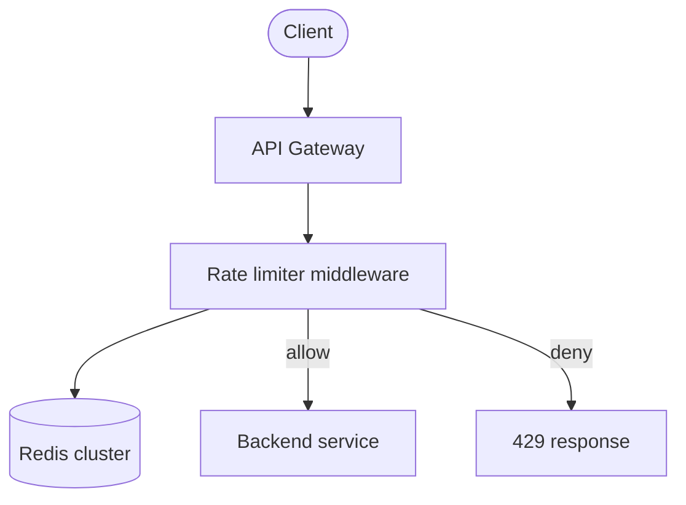

Protect APIs by limiting how many requests a client can make in a time window — essential for fairness, cost control, and abuse prevention.

## Requirements

**Functional**

- Allow N requests per client per window (e.g. 100 req/min per API key)
- Return **429 Too Many Requests** when exceeded
- Optional: different limits per tier / endpoint

**Non-functional**

- Low overhead on every request (microseconds)
- Accurate enough across multiple API servers
- Minimal false positives under burst traffic

## High-level design



Rate limiting runs **before** business logic — at gateway or sidecar.

## Algorithms

| Algorithm | Behavior | Notes |
|-----------|----------|-------|
| **Fixed window** | Count per clock minute | Simple; burst at window edges |
| **Sliding window log** | Timestamp each request | Accurate; memory heavy |
| **Sliding window counter** | Weighted previous + current window | Good balance |
| **Token bucket** | Refill tokens at steady rate; allow bursts | Common in APIs |
| **Leaky bucket** | Smooth output rate | Shapes traffic |

**Token bucket** is widely used: bucket holds tokens; each request consumes one; refill at rate `R` up to capacity `B`.

## Distributed enforcement

Single-server counters fail with horizontal scale. Use **Redis**:

```
KEY: rate:{client_id}:{window}
INCR + EXPIRE
```

For token bucket in Redis, use **Lua script** for atomic read-modify-write.

For multi-region:

- **Central Redis** — consistent, higher latency
- **Local counters + sync** — faster, eventually consistent
- **Sticky routing** — route client to same edge node (helps but not sufficient alone)

## API response headers

```
X-RateLimit-Limit: 100
X-RateLimit-Remaining: 42
X-RateLimit-Reset: 1717632000
Retry-After: 12
```

Clients can backoff without hammering the service.

## Failure modes

| Scenario | Policy |
|----------|--------|
| Redis down | **Fail open** (allow traffic) vs **fail closed** (block) — product decision |
| Clock skew | Prefer server-side windows; avoid client timestamps |
| Hot keys | Shard counter key by hash suffix |

## Trade-offs

- **Accuracy vs memory:** Sliding log is precise; fixed window is cheap.
- **Edge vs origin limiting:** Edge (CDN/gateway) saves origin load; origin limit catches bypass paths.
- **Per-IP vs per-key:** IP is easy to spoof; API keys are fairer for authenticated APIs.

---

You’ve reached the end of the starter series. Add more designs in `_system_design/` with `order: 4`, `5`, …
