> **Goal:** Design systems that handle more load without falling apart.  
> **Rule:** Measure the load first — scaling without metrics is guesswork.

Real platforms do not scale in one leap. **Netflix** serves ~200M+ subscribers with peak streaming in the tens of millions of concurrent sessions. **Meta** handles billions of daily active users on News Feed, Messenger, and Instagram. Both evolved through repeated bottleneck fixes — not a single architecture diagram drawn on day one.

This post covers how to think about that journey: what to measure, when to scale up vs out, and how each tier of a typical stack behaves under growth.

---

## Before you scale: measure the load

You cannot fix a bottleneck you have not identified. Before changing architecture, establish baselines and track trends as load grows.

| Metric | What it measures | Example (large consumer app) |
|--------|------------------|------------------------------|
| **Requests per second (RPS)** | API calls the system handles | Netflix API gateway: **millions of RPS** globally at peak |
| **Concurrent users** | Users active at the same time | Netflix: **~15M+ concurrent streams** during prime-time peaks |
| **Data volume** | Storage or processing footprint | Meta: **petabytes** of photos/video in object storage |
| **Throughput** | Data moved per unit time | Netflix CDN: **hundreds of Tb/s** aggregate during global peaks |
| **Query rate (QPS)** | Database queries per second | Social feed services: **millions of QPS** on read paths |
| **Message rate** | Queue/event throughput | Kafka at Meta/LinkedIn scale: **millions of events/sec** |

**What good looks like:** Latency percentiles (p50, p95, p99) stay stable as load increases. Ideally you see **linear or sublinear degradation** — doubling traffic should not double response time. When p99 spikes, error rates climb, or queues back up, you have hit a scalability wall.

**Interview line:** *"Before I scale anything, I identify the bottleneck with metrics — CPU, latency percentiles, QPS, queue depth, and error rate."*

---

## Two scaling approaches

Every component scales in one of two ways. Mature teams use both — vertical for quick wins, horizontal for long-term headroom.

### Vertical scaling (scale up)

Add more power to existing machines: CPU, RAM, faster SSDs, better network. One bigger box instead of many small ones.

| Action | When it helps |
|--------|---------------|
| Add CPU cores | Video transcoding, feed ranking, ML inference |
| Increase RAM | Larger in-memory caches (Redis), DB buffer pools |
| Faster SSDs / NVMe | Reduce I/O latency on primary databases |
| Upgrade network | CDN origin pulls, cross-AZ replication |

**When teams use it:**

- Early-stage products (pre-product-market fit) — simplest path, no distributed-system tax.
- **MySQL/PostgreSQL primaries** before read replicas or sharding are justified.
- Quick relief while you design horizontal changes — Netflix still vertically scales certain stateful analytics nodes before partitioning them.

**Trade-off:** Simple, but capped. The largest single instance is still one failure domain. Meta outgrew vertical scaling on single MySQL shards years ago; that ceiling is why sharding and distributed stores exist.

---

### Horizontal scaling (scale out)

Add more machines and spread load across them. This is how Netflix, Meta, and Amazon handle global traffic.

**How to achieve it:**

- **Load balancer** in front of identical app instances (AWS ALB, NGINX, Envoy).
- **Stateless services** so any instance can serve any request.
- **Auto-scaling** on CPU, RPS, or custom metrics (queue lag, cache hit ratio).
- **Multi-AZ / multi-region** deployment for fault tolerance and lower latency.

**Trade-off:** More moving parts — service discovery, distributed tracing, idempotent APIs, and careful data placement. But horizontal scale has no practical upper bound if the data tier can keep up.

---

### Stateless vs stateful services

Horizontal scaling works best when app servers do not hoard session state locally.

| | Stateless | Stateful |
|---|-----------|----------|
| **Session data** | Redis, DynamoDB, or JWT | Stored on the instance |
| **Scaling** | Add/remove instances freely | Sticky sessions or state migration |
| **Failure** | Any instance replaces another | Losing a node loses in-flight sessions |

**Real-world pattern:** Netflix microservices are stateless; playback state and profiles live in **Cassandra** and **EVCache** (Memcached). Meta's web tier is stateless; session and social graph data sit in **TAO**, **MySQL shards**, and **Memcached**.

**How to get there:**

- Move sessions to Redis or a distributed cache.
- Pass auth tokens on each request instead of server-side session affinity.
- Avoid load-balancer sticky sessions unless a legacy constraint forces them.

---

## Scaling by component

A production system is layered. Each tier has different limits and tools.

---

### Application tier

App servers run business logic — REST/GraphQL handlers, auth, feed assembly, playback orchestration. Under load they are usually **CPU- or thread-bound**.

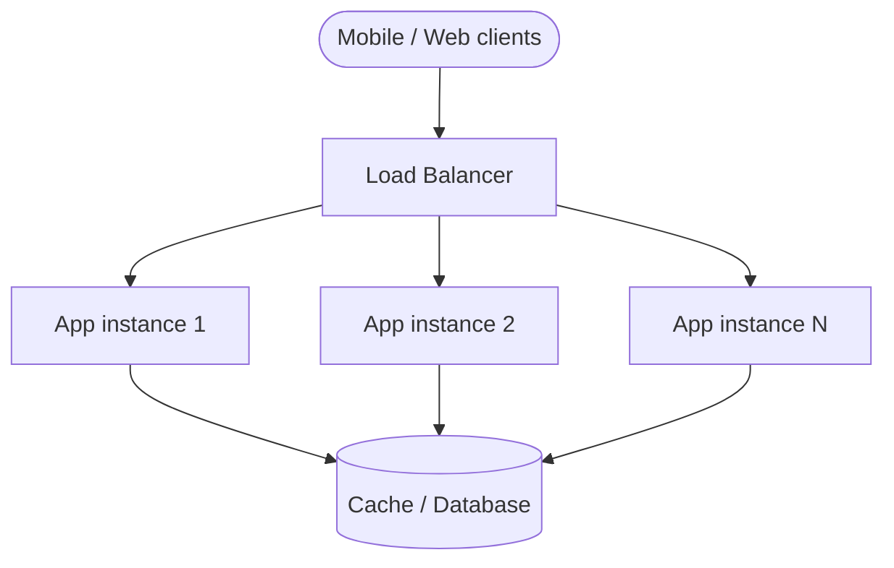

**How Netflix and Meta scale the app tier:**

| Strategy | What it does |
|----------|--------------|
| **Stateless services** | Any node handles any request; scale pods/containers independently |
| **Load balancing** | Spread traffic; drain unhealthy instances |
| **Auto-scaling** | Netflix scales **microservices** on AWS based on RPS and CPU |
| **Regional deployment** | Meta serves users from regional clusters to cut round-trip latency |

**Interview line:** *"App tier is the easiest to scale horizontally — stateless services behind a load balancer with auto-scaling."*

---

### Database tier

Databases are the **hardest tier to scale** because they own durable state. You cannot blindly put ten MySQL nodes behind a round-robin LB — writes need a single source of truth (or a carefully designed distributed protocol).

Consumer apps are almost always **read-heavy**. Meta's News Feed read path vastly dominates writes to the social graph. Netflix read patterns (browse catalog, fetch metadata) dominate writes (new titles, account updates).

**Scaling strategies:**

#### 1. Read replicas

Primary handles writes; replicas apply changes asynchronously and serve reads.

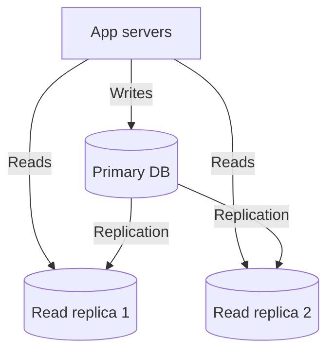

- **When to use:** Read:write ratio of **10:1 or higher** and the primary is not write-saturated.
- **Real example:** Meta used **MySQL read replicas** heavily before and alongside sharding for profile and timeline data.
- **Trade-off:** **Replication lag** — a post may not appear instantly on all replicas (eventual consistency on reads).

#### 2. Sharding (partitioning)

Split data across multiple databases using a **shard key** — typically `user_id`.

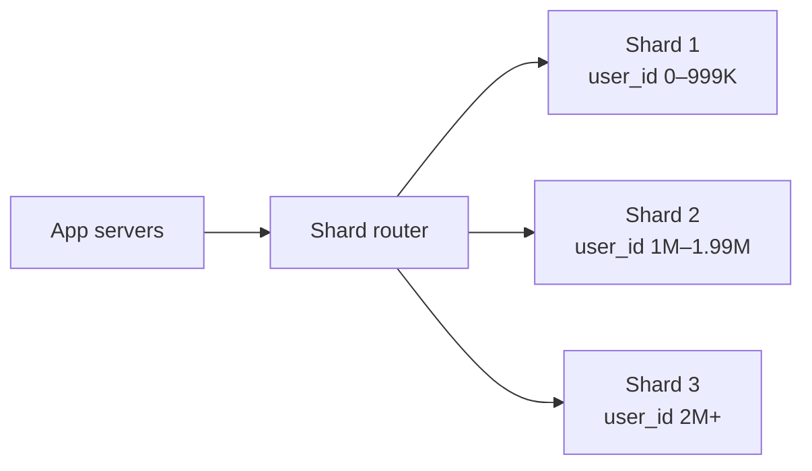

| Strategy | How it works |
|----------|--------------|
| **Range-based** | User IDs 0–1M on shard A (simple; risk of hot ranges) |
| **Hash-based** | `hash(user_id) % N` (even spread; re-sharding is painful) |
| **Directory-based** | Lookup table maps keys → shards (flexible; metadata service required) |

- **When to use:** Write QPS or storage exceeds one primary — Meta **sharded MySQL** for user data at billion-user scale.
- **Trade-off:** Cross-shard queries (e.g. "friends of friends" globally) become expensive; uneven shards ("hot" celebrities) need rebalancing.

#### 3. Distributed / NoSQL stores

**Cassandra** (Netflix), **DynamoDB**, **MongoDB sharded clusters** — built for partition tolerance and horizontal write scale.

- Automatic partitioning across nodes
- Often **eventual consistency** by default
- Data models favor **denormalization** over cross-partition joins

**Interview line:** *"Start with read replicas for read pressure. Shard when writes or disk exceed one primary. Consider managed sharding (Vitess, CockroachDB) before building a custom router."*

---

### Caching tier

Caches sit between apps and databases. A hit in **Redis** or **Memcached** is orders of magnitude faster than disk I/O. Netflix's **EVCache** and Meta's **Memcached** layers absorb enormous read volume so databases are not hammered on every request.

**Strategies:**

| Strategy | What it does |
|----------|--------------|
| **Cache-aside** | App reads cache first; on miss, loads from DB and populates cache |
| **Redis Cluster** | Partitions keys across nodes via hash slots |
| **Consistent hashing** | Minimizes key movement when nodes are added or removed |
| **TTL** | Evicts stale data; caps memory growth |

**Typical impact:** With a well-tuned cache, **80–90% of reads** never reach the database. Netflix caches catalog metadata and personalized rows aggressively before hitting Cassandra.

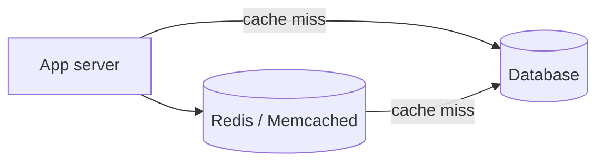

**Interview line:** *"Cache-aside with TTL. The cache is not the source of truth — the app must behave correctly on cache miss."*

---

### Message queue tier

Queues decouple producers from consumers. Spikes in one service do not instantly overwhelm downstream systems.

**Where you see this:**

- **Netflix:** Video **encoding pipelines** — uploads trigger async transcoding jobs across worker fleets.
- **Meta:** **News Feed fan-out** — publishing a post enqueues work to push updates to followers' feeds.
- **Both:** Analytics, notifications, and audit logs flow through **Kafka**-style pipelines.

| Strategy | What it does |
|----------|--------------|
| **Async decoupling** | Scale producers and consumers independently |
| **Buffer spikes** | Queue absorbs bursts; consumers drain at sustainable rate |
| **Partitioned topics** | Kafka partitions let multiple consumers parallelize |
| **Dead-letter queues** | Isolate poison messages for retry or inspection |

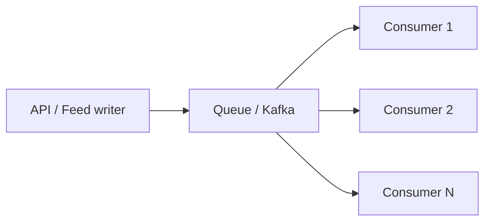

**Interview line:** *"Use queues for async work — scale consumers independently, buffer spikes, and keep the synchronous API path fast."*

---

## Walkthrough: scaling a Netflix-style streaming platform

Theory is easier with a concrete story. Imagine building a video streaming product — call it **StreamFlix** — from zero toward Netflix-scale. Each stage fixes the bottleneck the previous architecture could not survive.

---

### Stage 1: Single server (0–50K users)

Everything on one box: Spring/Node API, MySQL, and static assets together — how many student projects and MVPs start.

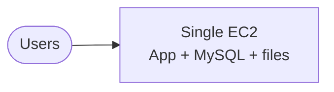

**Bottleneck:** CPU and RAM contention — a transcode or heavy query stalls API responses.

**Scale move:** Split the database onto its own instance (same pattern Netflix used before the microservices era).

---

### Stage 2: Separate database (50K–500K users)

App and MySQL run on dedicated hardware. You can tune each independently — `innodb_buffer_pool` on DB, thread pools on API.

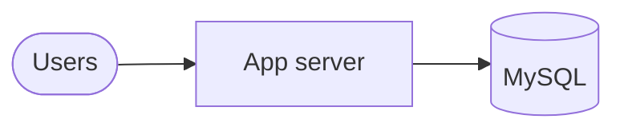

**Bottleneck:** Every **browse** and **title lookup** hits MySQL. Catalog reads dominate (Netflix-style apps are extremely read-heavy).

**Scale move:** Add **Redis** for catalog metadata, session tokens, and "continue watching" rows.

---

### Stage 3: Add caching (500K–2M users)

Hot keys — popular titles, homepage rows, user profiles — served from memory. MySQL handles cache misses only.

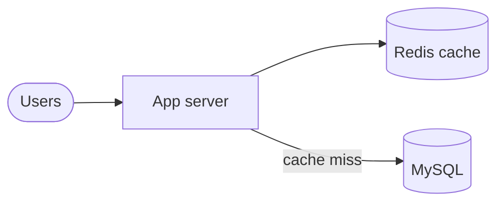

**Bottleneck:** One app server cannot handle evening **prime-time** traffic (Netflix sees massive concurrent playback starts at 8–10 PM local time).

**Scale move:** Multiple stateless app instances behind a **load balancer**.

---

### Stage 4: Multiple app servers (2M–20M users)

ALB distributes requests. Redis holds shared session and catalog cache. Still one MySQL primary — writes (signup, billing, watch history) and cache misses land there.

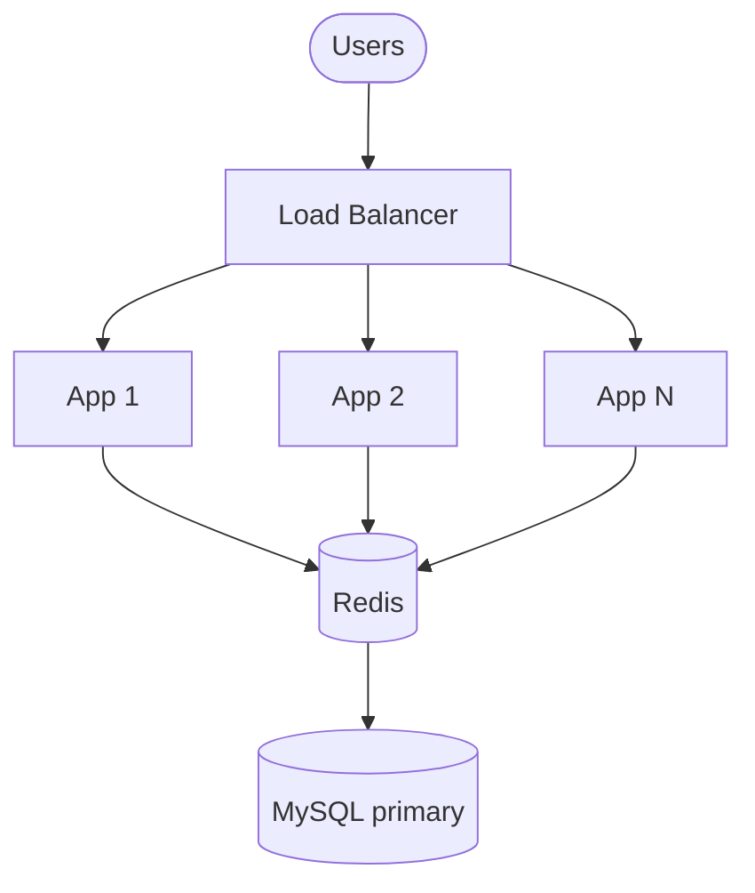

**Bottleneck:** Read QPS on MySQL — millions of users browsing catalogs and resuming playback.

**Scale move:** Add **read replicas**; route SELECTs to replicas, writes to primary.

---

### Stage 5: Read replicas (20M–100M users)

Primary handles account creation, subscription changes, and watch-progress writes. Replicas serve browse and search reads.

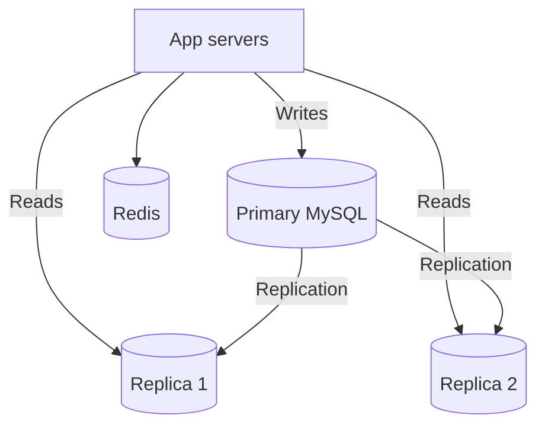

**Bottleneck:** **Write throughput** — every "play" event, rating, and profile update hits one primary. At Netflix scale this is why **Cassandra** replaced one-size-fits-all RDBMS paths for high-volume write workloads.

**Scale move:** **Shard** by `user_id`, or migrate hot paths to a write-optimized store.

---

### Stage 6: Sharding + CDN + async video pipeline (100M+ users)

**User data** shards by `user_id`. **Video bytes** never touch app servers — **CDN** (Netflix Open Connect, CloudFront) serves segments from edge PoPs close to users. **Uploads** go to object storage; **encoding** runs as async workers fed by a queue.

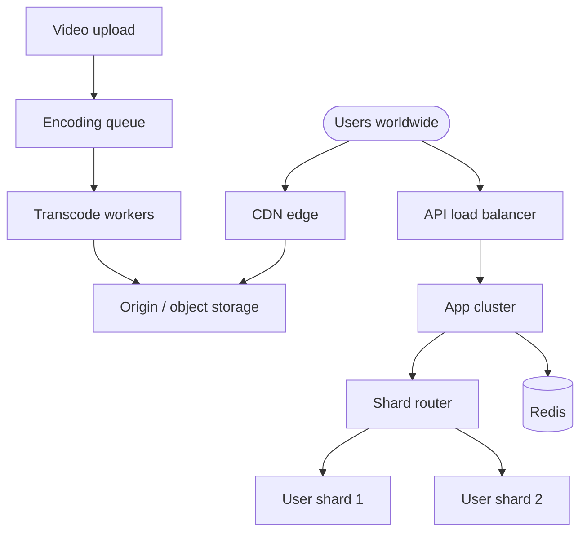

This mirrors how Netflix actually separates concerns: **API microservices**, **Cassandra** for high-volume data, **EVCache**, **CDN for video**, and **async pipelines** for encoding — not one giant monolith.

---

## Meta angle: what changes for a social feed?

A **Facebook-style News Feed** hits different bottlenecks at similar scale:

| Challenge | Scaling response |
|-----------|------------------|
| Fan-out on write (popular user posts) | Hybrid fan-out: async queue for normal users, precomputed feeds for celebrities |
| Graph reads (friends, groups) | **TAO**-style graph cache; denormalized feed stores |
| Real-time notifications | WebSockets + pub/sub; separate notification tier |
| Hot keys (viral post) | Aggressive caching; read replicas; sometimes application-level replication |

The tier-by-tier playbook is the same — cache, scale app servers, replicate reads, shard writes — but **feed fan-out** and **social graph traversal** drive queue and cache design more than raw video bandwidth.

---

## Summary

| Principle | Takeaway |
|-----------|----------|
| **Measure first** | Use RPS, p99 latency, QPS, and queue depth to find the real limit |
| **Vertical scaling** | Fast wins; hits a ceiling; one failure domain |
| **Horizontal scaling** | Requires stateless apps and thoughtful data design |
| **Tier-specific tactics** | Apps scale easily; databases and hot keys are hard |
| **Growth is sequential** | Netflix and Meta scaled in stages — each fix exposed the next bottleneck |

**Interview line:** *"Scalability is not one decision — it is a sequence of bottleneck fixes. Scale the component that metrics prove is limiting you, not the one that is easiest to diagram."*

---

**Next:** [URL Shortener]({{ '/system-design/url-shortener/' | relative_url }}) — apply these patterns to a concrete API design.
