> **Goal:** Design systems that handle more load without falling apart.  
> **Rule:** Measure the load first — scaling without metrics is guesswork.

Scalability is not a feature you bolt on at launch. It is a series of deliberate responses to real bottlenecks — each one visible only after you measure production behavior under stress.

---

## Before you scale: measure the load

You cannot improve what you do not quantify. Baseline your system under normal traffic, then stress-test or observe peak events (product launches, holiday sales, viral posts) to see where latency and errors first appear.

| Metric | What it measures | Illustrative scale |
|--------|------------------|-------------------|
| **Requests per second (RPS)** | Incoming API or HTTP calls | Regional checkout API: **~3,000 RPS** sustained |
| **Concurrent sessions** | Active users at one moment | Flash-sale event: **~80,000** simultaneous shoppers |
| **Stored data** | Durable footprint over time | Order + catalog history: **~25 TB** after three years |
| **Throughput** | Bytes moved per second | Image CDN during a campaign: **~400 MB/s** |
| **Database QPS** | Queries hitting the data tier | Product browse path: **~18,000 QPS** on reads |
| **Event rate** | Messages through async pipelines | Order-fulfillment stream: **~40,000 events/s** |

**Healthy scaling behavior:** p95 and p99 latency grow slowly relative to traffic. **Unhealthy:** response times double when load increases 30%, timeouts appear, or queue depth climbs without bound — you have found the limiting component.

**In interviews, say something like:** *"I start with saturation signals — CPU, memory, connection pool usage, p99 latency, and error budget burn — before choosing scale-up or scale-out."*

---

## Two scaling approaches

Every layer of the stack can grow in one of two directions. Strong teams combine both.

### Vertical scaling (scale up)

**Meaning:** Upgrade a single machine — more cores, RAM, faster disks, better NIC — instead of adding nodes.

| Upgrade | Typical fit |
|---------|-------------|
| More CPU | Payment fraud scoring, PDF generation, ML batch jobs |
| More RAM | In-process caches, larger DB buffer pools |
| NVMe / faster disks | Write-heavy transactional DB under I/O pressure |
| Higher network bandwidth | Bulk export, replication between regions |

**When it makes sense:**

- Early products with modest traffic — avoids distributed-system overhead.
- Database primaries before replication or partitioning is worth the ops cost.
- After tuning: indexes, pool sizes, and query plans often unlock headroom cheaply.

**Limitation:** One box has a maximum size and is a single point of failure. **Stripe** and **Shopify** ran large monoliths on powerful primaries long before sharding every table.

---

### Horizontal scaling (scale out)

**Meaning:** Add more machines and spread work across them — the path from a single EC2 instance to a fleet behind a load balancer.

**Practical steps:**

- Terminate TLS and route traffic through a **load balancer**.
- Keep application nodes **interchangeable** — no hidden local state.
- **Auto-scale** on RPS, CPU, or custom signals (queue lag, error rate).
- Spread across **availability zones** so one datacenter loss does not take the service offline.

**Limitation:** Coordination cost rises — discovery, observability, idempotent handlers, and data placement all matter. The upside is near-unlimited compute if the data layer can follow.

---

### Stateless vs stateful services

Horizontal scale works cleanly when any node can serve any request.

| | Stateless | Stateful |
|---|-----------|----------|
| **Where state lives** | Redis, Postgres, client token | Inside the process memory |
| **Adding capacity** | Register new instances immediately | Sticky routing or state migration |
| **Node failure** | Traffic shifts to peers | Sessions or jobs may be lost |

**Practical moves:** Externalize carts and login sessions to Redis; pass bearer tokens instead of server affinity; treat sticky load balancing as a last resort.

---

## Scaling by component

Monolith diagrams hide reality: each tier fails differently and needs its own playbook.

---

### Application tier

App servers execute business rules — auth checks, cart updates, search orchestration. They usually saturate on **CPU or thread pools** before anything else.

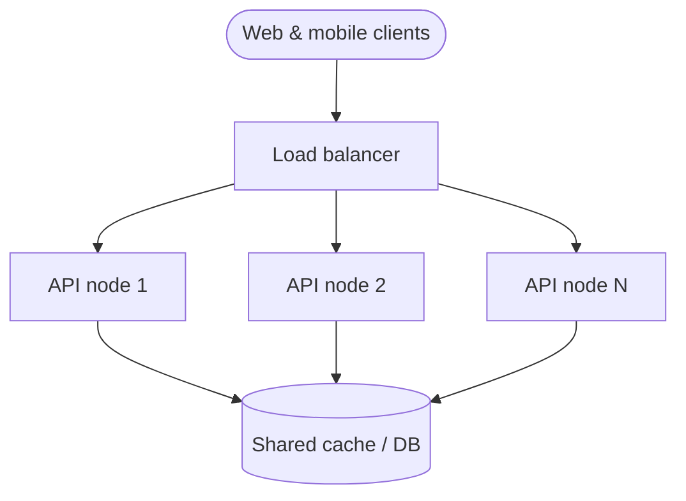

| Tactic | Effect |
|--------|--------|
| Stateless handlers | Scale out by adding identical pods |
| Health-checked LB | Unhealthy nodes stop receiving traffic |
| Auto-scaling groups | Capacity tracks diurnal or campaign spikes |
| Multi-region active-passive | Lower latency for distant users; DR readiness |

**Interview angle:** *"The compute tier is usually the cheapest to replicate — stateless APIs behind a load balancer and an autoscaler."*

---

### Database tier

Databases own **durable, consistent state** — you cannot round-robin writes across unrelated primaries without a partitioning story.

Most production workloads skew **read-heavy** (often 8:1 to 50:1 reads vs writes). Writes funnel to an authoritative primary; reads can fan out.

#### Read replicas

One primary accepts mutations; replicas apply the log and answer read queries.

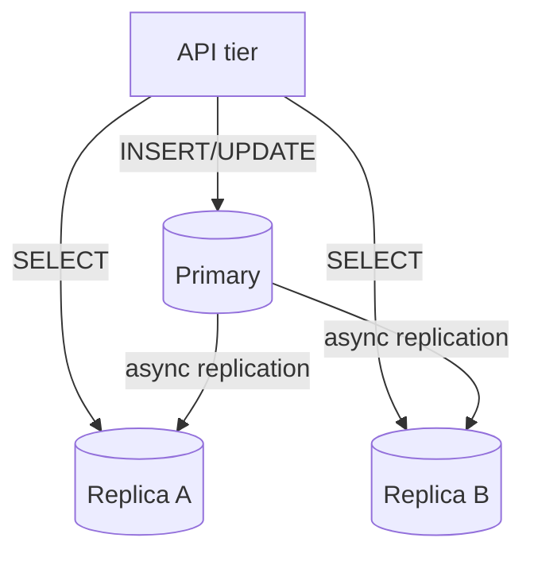

- **Fit:** Read pressure dominates; write volume still fits one primary.
- **Caveat:** **Replication lag** — a user may not see their own write on a replica for milliseconds (or longer under load).

#### Sharding (partitioning)

Split rows across multiple databases using a **shard key** — commonly `customer_id` or `tenant_id`.

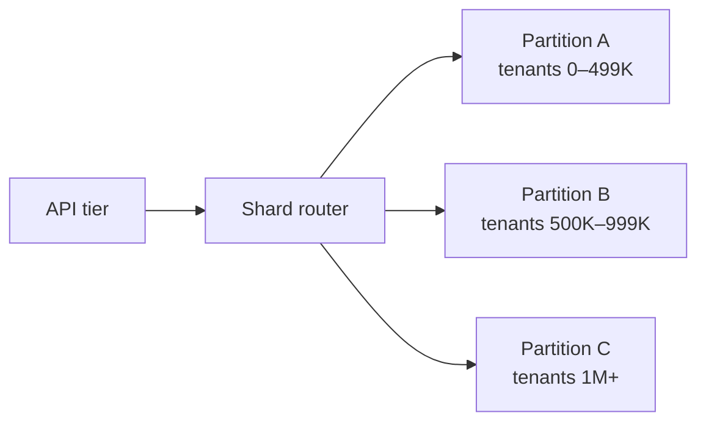

| Partition style | Idea |
|-----------------|------|
| Range | Keys grouped by ID bands — simple, risk of hot ranges |
| Hash | `hash(key) mod N` — even spread, painful resharding |
| Directory | Metadata service maps keys → shard — flexible ops |

- **Fit:** Write QPS or disk on one primary exceeds safe limits.
- **Caveat:** Joins across shards are expensive; celebrity tenants create **hot partitions**.

#### Distributed SQL / wide-column stores

**CockroachDB**, **Spanner**, **Cassandra**, **DynamoDB** — partition data by design, often trading immediate global consistency for partition tolerance.

**Interview angle:** *"Replicas first for read pressure; partition when the primary becomes the write or storage choke point; prefer managed sharding before a custom router."*

---

### Caching tier

Memory sits orders of magnitude closer to CPU than disk. A hit in **Redis** or **Memcached** can offload **90%+ of read QPS** from the database when access patterns are skewed (popular SKUs, session blobs, config flags).

| Pattern | Behavior |
|---------|----------|
| Cache-aside | App reads cache → on miss, loads DB and fills cache |
| Clustered Redis | Keys hashed across nodes |
| Consistent hashing | Adding nodes moves minimal key space |
| TTL | Automatic eviction; caps memory |

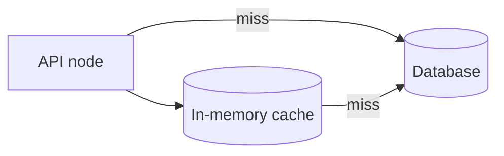

**Interview angle:** *"Treat cache as acceleration, not truth — every code path must survive a cold cache or node loss."*

---

### Message queue tier

Async pipelines **decouple** fast user-facing paths from slow background work: sending receipts, resizing photos, updating search indexes, syncing warehouses.

Peak HTTP traffic no longer forces every downstream system to absorb the same spike synchronously.

| Pattern | Behavior |
|---------|----------|
| Producer / consumer split | Scale workers without touching the API fleet |
| Backpressure buffer | Queue depth absorbs bursts |
| Partitioned logs (Kafka) | Parallel consumers per partition |
| Dead-letter queue | Poison messages isolated for inspection |

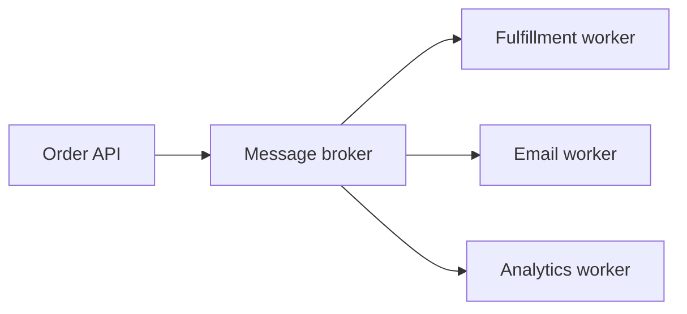

**Interview angle:** *"Push slow or spiky work off the request path — scale consumers on queue depth, not user clicks."*

---

## Walkthrough: scaling a food-delivery marketplace

Imagine **QuickPlate** — users browse restaurants, place orders, and track couriers. Growth forces architectural changes in a predictable order. Numbers are illustrative, not prescriptions.

---

### Stage 1: Monolith on one host (0–5K daily orders)

API, background jobs, and **PostgreSQL** share one VM. Fast to build, cheap to operate.

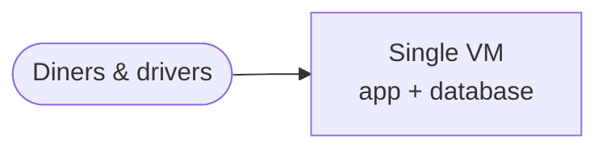

**First pain point:** CPU spikes during dinner rush; DB and app contend for the same RAM.

**Next step:** Move PostgreSQL to a dedicated host.

---

### Stage 2: Split compute and database (5K–40K daily orders)

The API VM talks to a separate DB instance. Tune connection limits and `shared_buffers` independently.

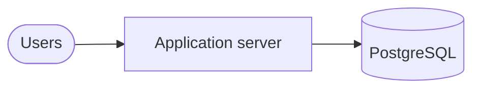

**First pain point:** Menu and restaurant listings hammer the DB on every page view.

**Next step:** Introduce **Redis** for hot keys (menus, open hours, session tokens).

---

### Stage 3: Cache hot reads (40K–200K daily orders)

Repeated catalog reads served from memory; DB sees mostly misses and writes (new orders, status updates).

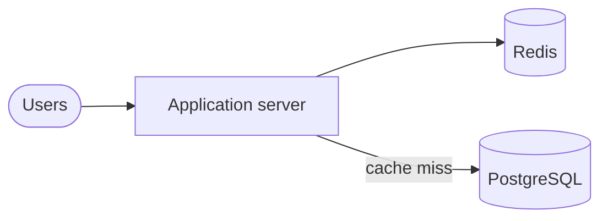

**First pain point:** One app process cannot accept enough concurrent checkout requests.

**Next step:** Multiple app instances behind a **load balancer**.

---

### Stage 4: Horizontally scaled API tier (200K–1M daily orders)

Stateless API nodes share Redis for sessions and cart drafts. PostgreSQL still single-primary.

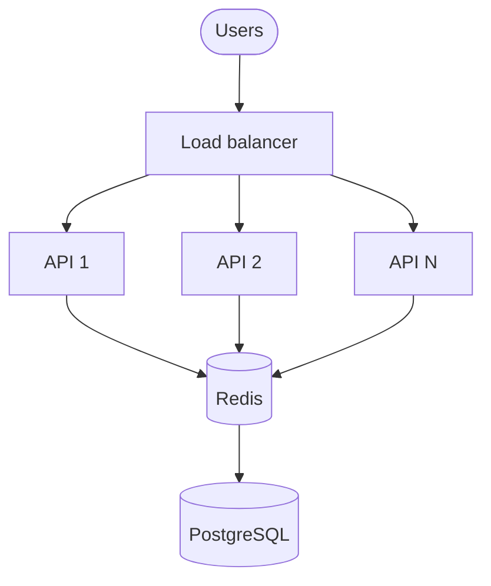

**First pain point:** Read QPS from browse + order tracking overwhelms the primary.

**Next step:** Add **read replicas** for reporting, history, and non-critical SELECTs.

---

### Stage 5: Read replicas (1M–5M daily orders)

Writes (new orders, status transitions) stay on the primary; replica nodes serve driver earnings history and admin dashboards.

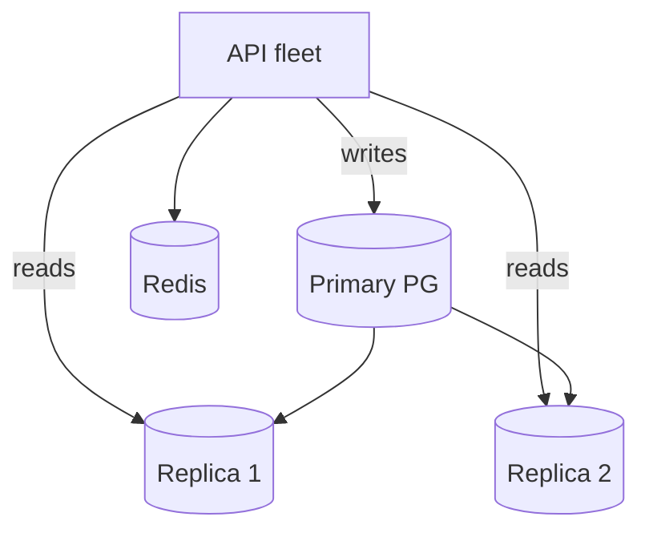

**First pain point:** Write rate on peak Friday nights exceeds single-primary ingest.

**Next step:** **Shard** by city or merchant region, or migrate high-volume tables to a write-optimized store.

---

### Stage 6: Partitioned data + async fulfillment (5M+ daily orders)

Orders partitioned by **metro area**. Courier assignment and receipt email run through **Kafka** workers. Static assets and menu photos served from a **CDN** — bytes never touch the API.

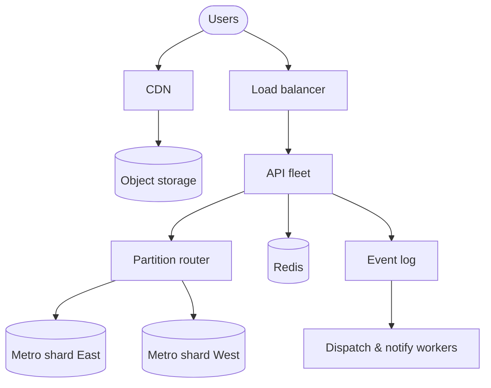

**Ongoing cost:** Cross-metro analytics need federated queries; uneven city growth requires rebalancing shards.

---

## Summary

| Idea | Remember |
|------|----------|
| **Measure first** | Metrics expose the real bottleneck — not the diagram you wish you had |
| **Scale up** | Quick relief, hard ceiling, single failure domain |
| **Scale out** | Needs stateless apps and a data strategy that can keep up |
| **Per-tier tactics** | Compute scales easily; stateful stores need replicas, caches, partitions |
| **Recurring tools** | Load balancers, caches, queues, replicas, and shards show up everywhere |

**Closing thought:** Scalability is a **sequence of constraint removals**. Each growth phase reveals the next weakest link — scale that component, re-measure, repeat.
