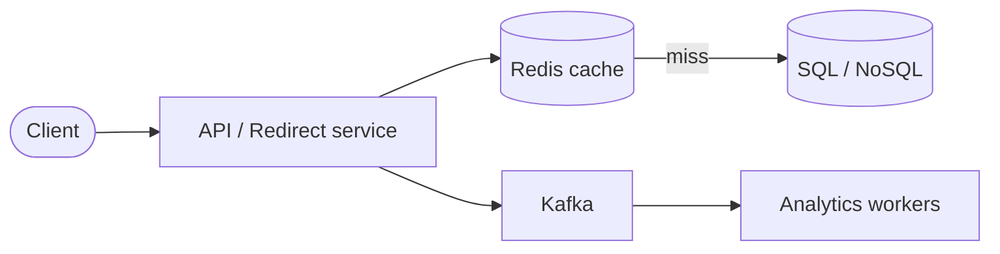

Design a service like **bit.ly**: given a long URL, return a short code; visiting the code redirects to the original URL.

## Requirements

**Functional**

- Shorten a long URL → unique short link
- Redirect short link → original URL (HTTP 301/302)
- Optional: custom aliases, expiration, analytics

**Non-functional**

- Very low latency on **redirect** (read-heavy)
- High availability — broken links hurt trust
- Short codes should be unpredictable (avoid enumeration)

## Capacity estimate (rough)

| Assumption | Value |
|------------|-------|
| New URLs / day | 100M |
| Read : write ratio | 100 : 1 |
| Redirect QPS (avg) | ~100M × 100 / 86400 ≈ **116K** |
| Storage (5 years) | 100M × 365 × 5 × 500 B ≈ **90 TB** metadata |

Redirect path must be fast — cache aggressively.

## High-level design



- **Write path:** API → generate code → persist → return short URL
- **Read path:** API → cache lookup → DB on miss → 302 redirect

## API sketch

```
POST /api/v1/urls
  body: { "long_url": "https://...", "ttl_days": 365 }
  → 201 { "short_url": "https://go.example/abc12X" }

GET /{code}
  → 302 Location: long_url
```

## Short code generation

Options:

| Approach | Pros | Cons |
|----------|------|------|
| Base62 counter | Simple, no collisions | Single DB bottleneck; predictable if leaked |
| MD5/SHA + truncate | Distributed | Collisions → retry |
| Snowflake-style ID + Base62 | Ordered, unique | Needs ID service |

Production systems often use **pre-generated ID ranges** or **hash + collision check**.

## Data model

```
urls(
  id            BIGINT PK,
  short_code    VARCHAR(8) UNIQUE,
  long_url      TEXT,
  created_at    TIMESTAMP,
  expires_at    TIMESTAMP NULL,
  owner_id      BIGINT NULL
)
```

Index on `short_code` for O(1) lookups.

## Deep dives

**Cache strategy:** Cache hot codes in Redis with TTL; on write, invalidate or write-through. 80/20 traffic often hits a small key set.

**Redirect type:** **301** permanent (browser caches — hard to change destination); **302** temporary (better if URLs can change).

**Hot keys:** Celebrity links → single Redis shard overload. Mitigate with local in-process cache + replication.

**Analytics:** Async via Kafka so redirect path stays lean.

## Trade-offs

- **SQL vs NoSQL:** SQL fits strong uniqueness on `short_code`; DynamoDB/Cassandra scale writes if counter is sharded.
- **Sync vs async analytics:** Async improves redirect latency; analytics may lag seconds.
- **Global deployment:** Geo-routed DNS + regional caches reduce cross-region latency.

---

**Next:** [Rate Limiter]({{ '/system-design/rate-limiter/' | relative_url }})
