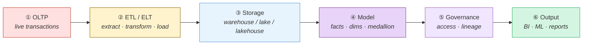
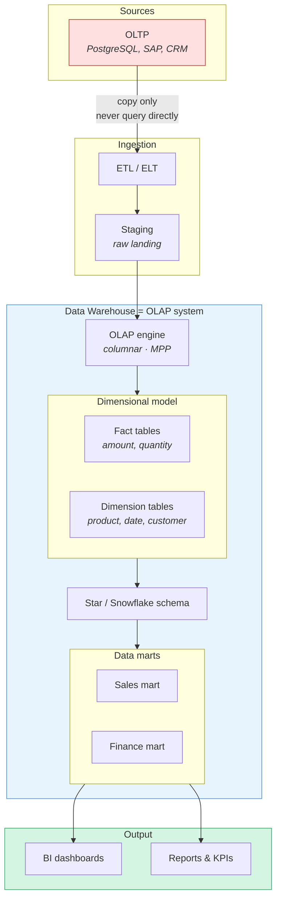
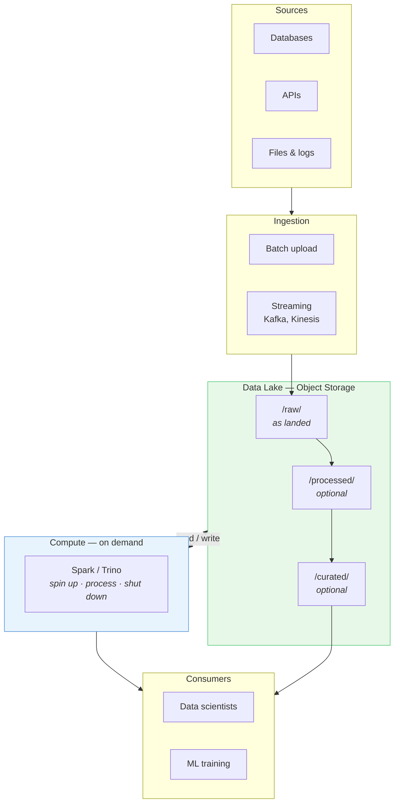
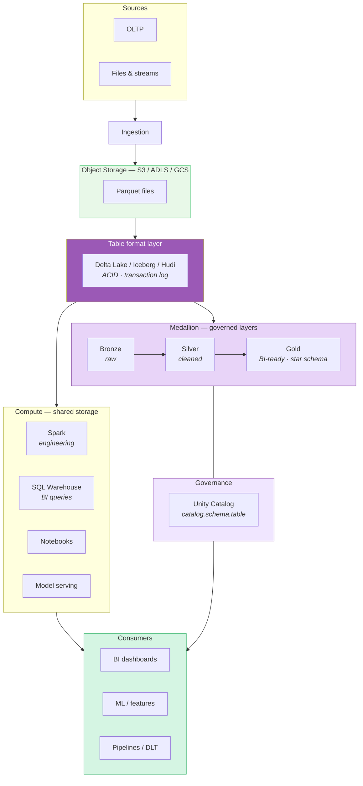
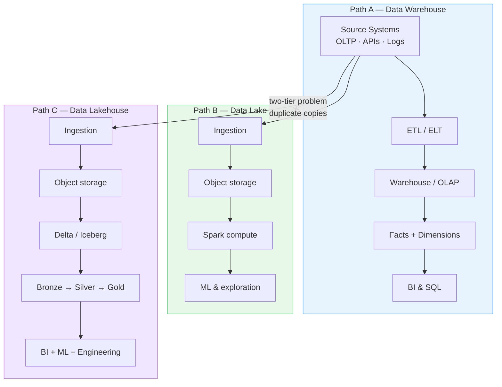
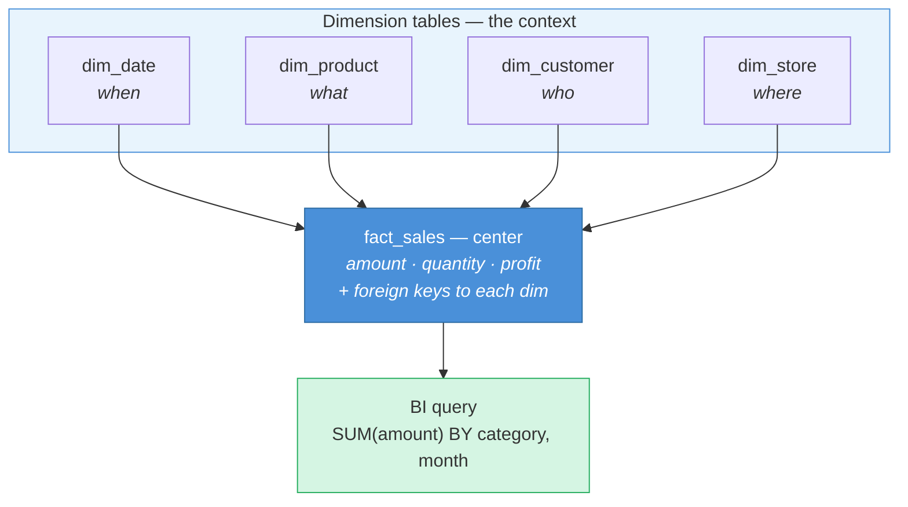

This page is the map — where each component lives and how data moves from source systems to dashboards. Read it once, then jump to the topic pages for depth.

| Page | Topics |
|------|--------|
| [Data Warehouse](/data-architecture/data-warehouse/) | OLTP, OLAP, ETL, fact/dimension, star/snowflake schema |
| [Data Lake](/data-architecture/data-lake/) | Object storage, schema-on-read, data swamp |
| [Data Lakehouse](/data-architecture/data-lakehouse/) | Delta Lake, medallion, Unity Catalog |

---

## 1. The full journey (left → right)

One line from live transactions to business insight:

| Step | Component | What happens |
|------|-----------|--------------|
| ① | **OLTP** | Apps record orders, payments, logins in real time |
| ② | **ETL / ELT** | Data is copied, cleaned, and reshaped |
| ③ | **Storage** | Data lands in a warehouse, lake, or lakehouse |
| ④ | **Model** | Facts, dimensions, bronze/silver/gold layers |
| ⑤ | **Governance** | Permissions, catalog, lineage, audit |
| ⑥ | **Output** | Dashboards, SQL reports, ML models |

---

## 2. Layer stack — where components sit

Vertical view: each layer has a job. Data flows **down through ingestion**, sits in **storage**, is shaped by **modeling**, controlled by **governance**, and consumed at the top.

```mermaid
flowchart TB
    subgraph L6["⑥ CONSUMPTION — who uses the data"]
        direction LR
        BI["BI & Dashboards<br/>Tableau, Power BI"]
        SQL["SQL Analysts"]
        ML["ML & Data Science"]
    end

    subgraph L5["⑤ GOVERNANCE — who can see what"]
        UC["Unity Catalog / Warehouse ACLs<br/><i>permissions · lineage · audit</i>"]
    end

    subgraph L4["④ MODELING — how data is organized"]
        direction LR
        FACT["Fact tables<br/><i>how much</i>"]
        DIM["Dimension tables<br/><i>who / what / when</i>"]
        STAR["Star / Snowflake schema"]
        MED["Medallion<br/>Bronze → Silver → Gold"]
    end

    subgraph L3["③ STORAGE — where data lives"]
        direction LR
        WH["Data Warehouse<br/><i>OLAP · columnar</i>"]
        LAKE["Data Lake<br/><i>S3 / ADLS / GCS</i>"]
        LH["Lakehouse<br/><i>Delta / Iceberg on object storage</i>"]
    end

    subgraph L2["② INGESTION — how data moves in"]
        ETL["ETL / ELT pipeline<br/><i>Extract → Transform → Load</i>"]
        STG["Staging area<br/><i>temporary landing</i>"]
    end

    subgraph L1["① SOURCES — where data is born"]
        direction LR
        OLTP["OLTP databases<br/>PostgreSQL, SAP, CRM"]
        API["APIs & SaaS"]
        LOG["Logs, IoT, files"]
    end

    L1 --> L2
    L2 --> L3
    L3 --> L4
    L4 --> L5
    L5 --> L6

    style L1 fill:#FFE0E0,stroke:#C0392B
    style L2 fill:#FFF3CD,stroke:#856404
    style L3 fill:#E8F4FD,stroke:#4A90D9
    style L4 fill:#E8D4F8,stroke:#7D3C98
    style L5 fill:#F0E6FF,stroke:#9B59B6
    style L6 fill:#D5F5E3,stroke:#27AE60
```

---

## 3. Data warehouse path — internal wiring

How warehouse-specific components connect. Full detail → [Data Warehouse](/data-architecture/data-warehouse/).

### Warehouse component reference

| Component | Sits at | Connected to | Role |
|-----------|---------|--------------|------|
| **OLTP** | Source layer | → ETL | Live transaction data (input) |
| **ETL / ELT** | Ingestion layer | OLTP → Staging | Extract, transform, load |
| **Staging** | Ingestion layer | → OLAP engine | Temporary raw landing |
| **OLAP engine** | Storage layer | Fact + Dim tables | Analytics-optimized compute + storage |
| **Fact table** | Model layer | Dimensions via keys | Numbers — how much, how many |
| **Dimension table** | Model layer | Facts via keys | Labels — who, what, when, where |
| **Star / Snowflake schema** | Model layer | Facts + Dims | Layout of the dimensional model |
| **Data mart** | Model layer | → BI | Department-specific subset |
| **BI / Reports** | Consumption layer | ← Data marts | Dashboards, KPIs (output) |

---

## 4. Data lake path — internal wiring

Lake-specific components. Full detail → [Data Lake](/data-architecture/data-lake/).

---

## 5. Lakehouse path — unified wiring (modern)

How lake + warehouse capabilities merge on one platform. Full detail → [Data Lakehouse](/data-architecture/data-lakehouse/).

### Where warehouse concepts sit inside a lakehouse

| Warehouse concept | Lakehouse location |
|-------------------|-------------------|
| OLTP (source) | Same — feeds ingestion |
| ETL / ELT | Pipelines, DLT, Jobs |
| OLAP engine | SQL Warehouse + Spark |
| Fact / Dimension tables | **Gold layer** (star schema) |
| Data marts | Gold schemas per department |
| BI output | Dashboards query Gold via SQL Warehouse |

---

## 6. All three paradigms — side by side

Same sources, three different architecture choices (and why lakehouse replaced the two-tier split):

---

## 7. Star schema — fact & dimension seating

Where fact and dimension tables sit inside the warehouse model:

---

## 8. Component index — quick lookup

| Component | Layer | Paradigm | Read more |
|-----------|-------|----------|-----------|
| OLTP | Source | All | [Data Warehouse — OLTP](/data-architecture/data-warehouse/#oltp-vs-olap) |
| ETL / ELT | Ingestion | Warehouse, Lakehouse | [Data Warehouse — ETL](/data-architecture/data-warehouse/#etl-vs-elt) |
| Staging | Ingestion | Warehouse | [Data Warehouse — Architecture](/data-architecture/data-warehouse/#how-it-works-architecture) |
| OLAP / Warehouse | Storage | Warehouse | [Data Warehouse — OLAP](/data-architecture/data-warehouse/#oltp-vs-olap) |
| Fact table | Model | Warehouse, Lakehouse Gold | [Data Warehouse — Facts](/data-architecture/data-warehouse/#fact-tables) |
| Dimension table | Model | Warehouse, Lakehouse Gold | [Data Warehouse — Dimensions](/data-architecture/data-warehouse/#dimension-tables) |
| Star schema | Model | Warehouse | [Data Warehouse — Star](/data-architecture/data-warehouse/#star-schema) |
| Snowflake schema | Model | Warehouse | [Data Warehouse — Snowflake](/data-architecture/data-warehouse/#snowflake-schema) |
| SCD | Model | Warehouse | [Data Warehouse — SCD](/data-architecture/data-warehouse/#grain-keys--slowly-changing-dimensions) |
| Data mart | Model | Warehouse | [Data Warehouse — Marts](/data-architecture/data-warehouse/#data-marts--conformed-dimensions) |
| Object storage | Storage | Lake, Lakehouse | [Data Lake — Architecture](/data-architecture/data-lake/#how-it-works-architecture) |
| Schema-on-read | Model | Lake | [Data Lake — Schema-on-read](/data-architecture/data-lake/#core-characteristics) |
| Delta / Iceberg / Hudi | Storage | Lakehouse | [Data Lakehouse — Table format](/data-architecture/data-lakehouse/#1-open-table-format-the-technical-foundation) |
| Medallion (Bronze/Silver/Gold) | Model | Lakehouse | [Data Lakehouse — Medallion](/data-architecture/data-lakehouse/#2-medallion-architecture-organizational-pattern) |
| Unity Catalog | Governance | Lakehouse | [Data Lakehouse — Governance](/data-architecture/data-lakehouse/#3-unified-governance) |
| SQL Warehouse | Compute | Lakehouse, Databricks | [Data Lakehouse — Compute](/data-architecture/data-lakehouse/#4-separate-compute-shared-storage) |
| BI / Dashboards | Consumption | All | [Data Warehouse — Architecture](/data-architecture/data-warehouse/#how-it-works-architecture) |

---

**Back to overview:** [Overview](/data-architecture/overview/)
