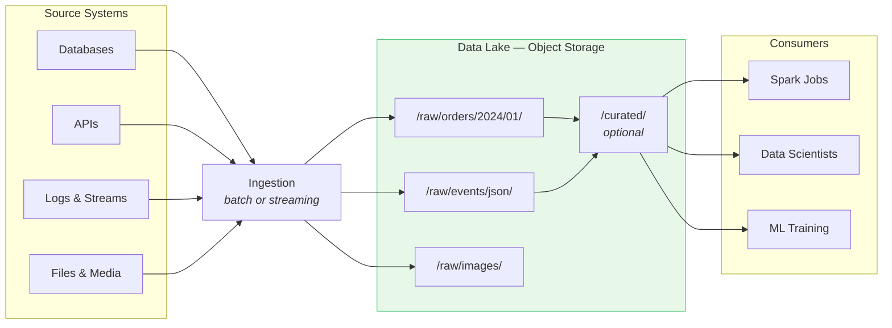
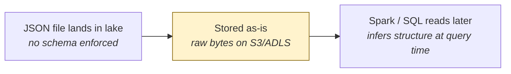
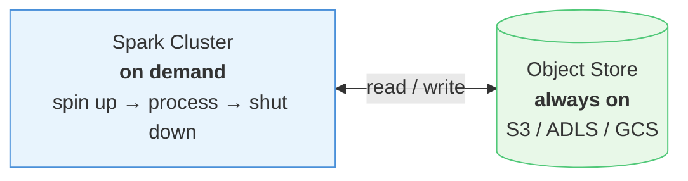
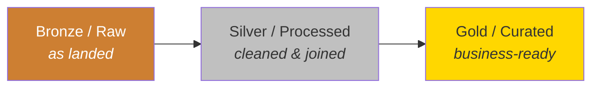
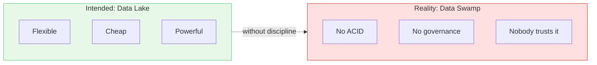

> **Scope:** This document covers **data lake** topics only — object storage, schema-on-read, ingestion, storage/compute separation, informal medallion zones, and the data swamp problem.
>
> For **warehouse fundamentals** (OLTP, OLAP, star schema, etc.) → [data-warehouse.md](/data-architecture/data-warehouse/) · For **lakehouse** → [data-lakehouse.md](/data-architecture/data-lakehouse/)

A **data lake** is a centralized repository that stores **raw data in its native format** at **massive scale**, typically on **cheap cloud object storage** (S3, ADLS, GCS).

Think of it as a **giant shared drive for all company data** — structured tables, JSON logs, CSV exports, images, videos, and more — without forcing everything into one rigid schema upfront.

---

## What problem it solved

[Data warehouses](/data-architecture/data-warehouse/) were too slow and expensive to onboard new data types. Meanwhile, companies were generating huge volumes of:

- Web and mobile clickstreams
- IoT sensor readings
- Application logs
- JSON from APIs
- Data science experiments

The lake answered:

> "Store everything cheaply now; figure out how to use it later."

---

## How it works (architecture)

### Key components

| Component | Role |
|-----------|------|
| **Object storage** | Durable, low-cost files (the lake itself) |
| **Ingestion** | Batch uploads, streaming (Kafka/Kinesis), copy jobs |
| **Processing engine** | Spark, Presto/Trino, Hive — read files and run transformations |
| **Catalog (optional)** | Hive Metastore, AWS Glue — track what files mean |
| **Zones / folders** | Often `raw`, `processed`, `curated` — informal layering |

---

## Core characteristics

### 1. Schema-on-read
Structure is applied **when you query**, not when you store.

**Benefit:** Ingest fast; no upfront modeling.  
**Trade-off:** Easy to accumulate messy, undocumented, duplicate data.

### 2. Store any data type
- Structured: Parquet, CSV, ORC
- Semi-structured: JSON, XML, Avro
- Unstructured: images, PDFs, video, audio

### 3. Decouple storage and compute
Storage is cheap and always on. Compute clusters spin up only when needed, process files, then shut down. This is the foundation of modern cloud data platforms.

### 4. Scale-out by design
Add more files and more machines — no single database server to upgrade.

### 5. Great for exploration and ML
Data scientists can access raw data, build features, train models, and experiment without waiting for a warehouse modeling cycle.

---

## Common layering (informal medallion)

Many lakes adopt folder-based zones — not always enforced:

| Zone | Contents |
|------|----------|
| **Raw / Bronze** | Data as landed from source |
| **Processed / Silver** | Cleaned, deduplicated, joined |
| **Curated / Gold** | Business-ready datasets |

Unlike a [data warehouse](/data-architecture/data-warehouse/), these zones are often **just directories** with weak enforcement.

---

## Strengths

- **Low cost at scale** — object storage is pennies per GB
- **Flexibility** — any format, any schema, fast ingestion
- **One copy for many workloads** — engineering, science, and ad-hoc exploration
- **ML-ready** — raw features and unstructured data stay accessible

---

## Problems (the "data swamp")

Without strict governance, lakes often failed to deliver the trust that [warehouses](/data-architecture/data-warehouse/) provide natively:

| Problem | What happens |
|---------|--------------|
| **No ACID** | Concurrent writes corrupt files; partial updates leave bad state |
| **Small files** | Millions of tiny files → slow queries |
| **No single truth** | Ten teams create ten versions of "customers" |
| **Poor performance for BI** | SQL on raw files is slow without heavy optimization |
| **Weak governance** | Who owns this folder? Who can see PII? Hard to audit |
| **Schema drift** | Same JSON field changes type; downstream jobs break silently |

This gap — lake flexibility without warehouse reliability — is what the [lakehouse](/data-architecture/data-lakehouse/) was built to close.

---

## Examples (technologies)

- **Storage:** Amazon S3, Azure Data Lake Storage Gen2, Google Cloud Storage
- **Processing:** Apache Spark, Hadoop MapReduce, Presto/Trino
- **Catalogs:** Hive Metastore, AWS Glue Data Catalog
- **Formats:** Parquet, ORC, Avro, JSON (files on object storage)

---

## How the lake differs from a warehouse

This section covers **only the lake side**. Full warehouse depth (OLTP/OLAP, star schema, ETL, Kimball, Snowflake platform, etc.) lives in [data-warehouse.md](/data-architecture/data-warehouse/).

| Lake trait | Warehouse trait (see other doc) |
|------------|--------------------------------|
| Schema-on-read | Schema-on-write |
| Cheap object storage (S3, ADLS) | Proprietary / managed DB storage |
| Any data type | Mostly structured tables |
| Weak governance by default | Strong governance natively |
| Best for engineering & ML | Best for BI & SQL dashboards |

Many enterprises ran **both** in parallel — see the two-tier problem in [data-lakehouse.md](/data-architecture/data-lakehouse/).

---

## One-sentence summary

> A **data lake** is cheap, scalable storage for all data types with flexible schema-on-read — but without extra layers it often lacks the reliability, performance, and governance that [warehouses](/data-architecture/data-warehouse/) provide.

**Next:** [Data Lakehouse](/data-architecture/data-lakehouse/) — how lake storage gained warehouse capabilities.
