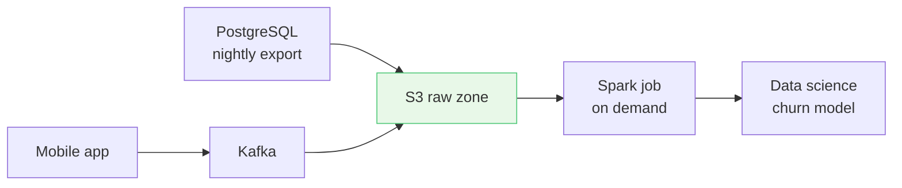
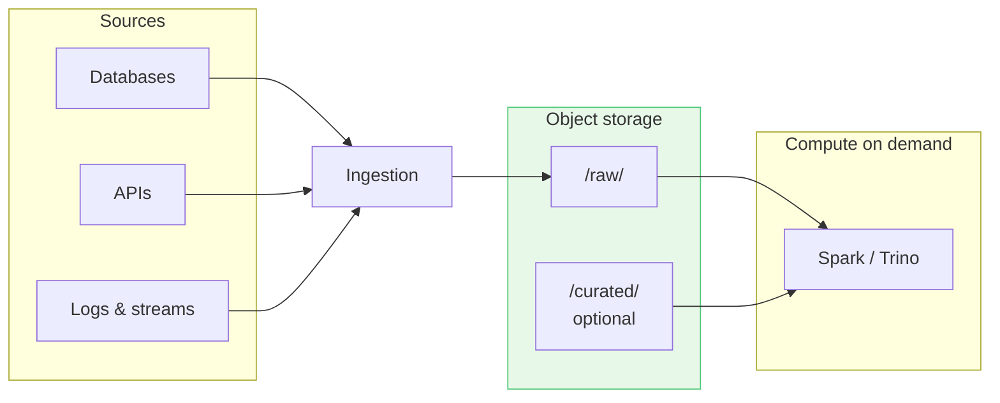
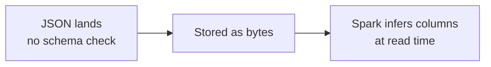
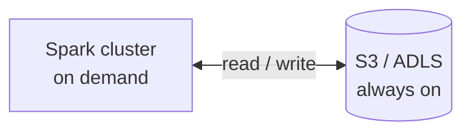
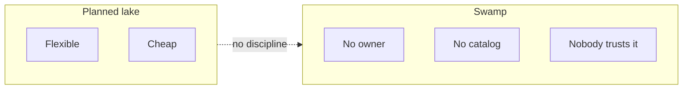

> **Goal:** Land diverse data cheaply without modeling everything upfront.  
> **Rule:** A lake without ownership becomes a swamp - folders are not governance.

A lake is object storage (S3, ADLS, GCS) holding files as they arrive: Parquet exports, JSON event logs, CSV dumps, even images. You apply structure **when you read**, not when you write. Warehouse modeling is on the [Data Warehouse](/data-architecture/data-warehouse/) page; how lakes gained ACID and SQL is on [Data Lakehouse](/data-architecture/data-lakehouse/).

---

## Walkthrough: event data on a lake

A growing food-delivery app generates data the warehouse was never built to ingest on day one:

| Source | Format | Why not straight into the warehouse? |
|--------|--------|--------------------------------------|
| App clickstream | JSON | Schema changes every release |
| Driver location | High-volume events | Too expensive to model before use |
| Menu photos | JPEG on S3 | Unstructured |
| Nightly order export | Parquet | Already structured - but mixed with the above |

The lake path: dump everything under `s3://company-lake/raw/...`, spin up Spark when someone needs an analysis, shut compute down when done.

**First win:** Data science gets raw events without waiting six weeks for a dimensional model.

**First pain point:** Three teams write `s3://.../customers/` differently. Nobody trusts the counts.

**Next step:** Either enforce zones and catalogs, or move toward a [lakehouse](/data-architecture/data-lakehouse/) with Delta tables and Unity Catalog.

---

## Architecture

| Piece | Role |
|-------|------|
| **Object storage** | The lake itself - durable, pennies per GB |
| **Ingestion** | Batch copy, Kafka/Kinesis streams, Fivetran-style loads |
| **Compute** | Spark, Trino, Hive - separate from storage, billed only when running |
| **Catalog (optional)** | Glue, Hive Metastore - otherwise you grep paths |

---

## Schema-on-read

Structure is inferred at query time, not enforced at landing.

**Trade-off:** Fast ingest, slow trust. A field that was `string` last month becomes `int` this month and silently breaks downstream jobs.

---

## Storage vs compute

Object storage stays on 24/7. Clusters spin up, process, spin down. That separation is why lakes beat loading everything into a proprietary warehouse when volume spikes.

---

## Informal zones (bronze / silver / gold)

Many teams use folder names as quality tiers - **not** enforced unless pipelines say so:

| Zone | Typical contents |
|------|------------------|
| **Bronze / raw** | As landed from source |
| **Silver** | Cleaned, deduped |
| **Gold** | Business-ready aggregates |

Unlike a [warehouse](/data-architecture/data-warehouse/), these are often just paths. The [lakehouse](/data-architecture/data-lakehouse/) makes them real tables with ACID.

---

## When lakes go wrong (the swamp)

| Symptom | What you see |
|---------|--------------|
| No ACID | Two jobs write the same partition; files corrupt |
| Small files | Millions of 4 KB objects; queries crawl |
| Duplicate "truth" | Ten definitions of `active_customer` |
| BI on raw JSON | Analysts wait minutes for a simple `GROUP BY` |

That gap is why [lakehouses](/data-architecture/data-lakehouse/) exist - keep lake economics, add warehouse-grade tables and governance.

---

## Common stack

- **Storage:** S3, ADLS Gen2, GCS
- **Processing:** Spark, Trino
- **Catalogs:** Glue, Hive Metastore
- **Formats:** Parquet, ORC, Avro, JSON

---

## Summary

| Idea | Remember |
|------|----------|
| **Schema-on-read** | Ingest now, shape later |
| **Cheap scale** | Object storage + elastic compute |
| **Swamp risk** | No ACID, no catalog, no owners |
| **Exit ramp** | Delta/Iceberg + medallion → lakehouse |

**Closing thought:** A lake is the right first move when you have volume and variety you cannot model yet. It is the wrong final state if executives still need trusted revenue numbers without a governed Gold layer.

**Next:** [Data Lakehouse](/data-architecture/data-lakehouse/)
