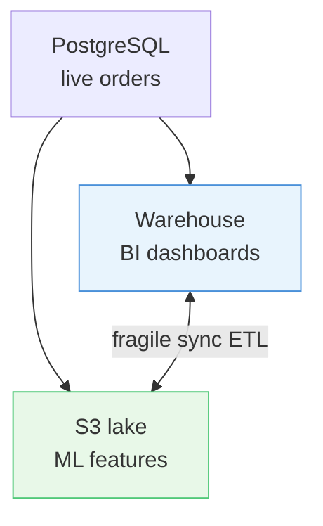
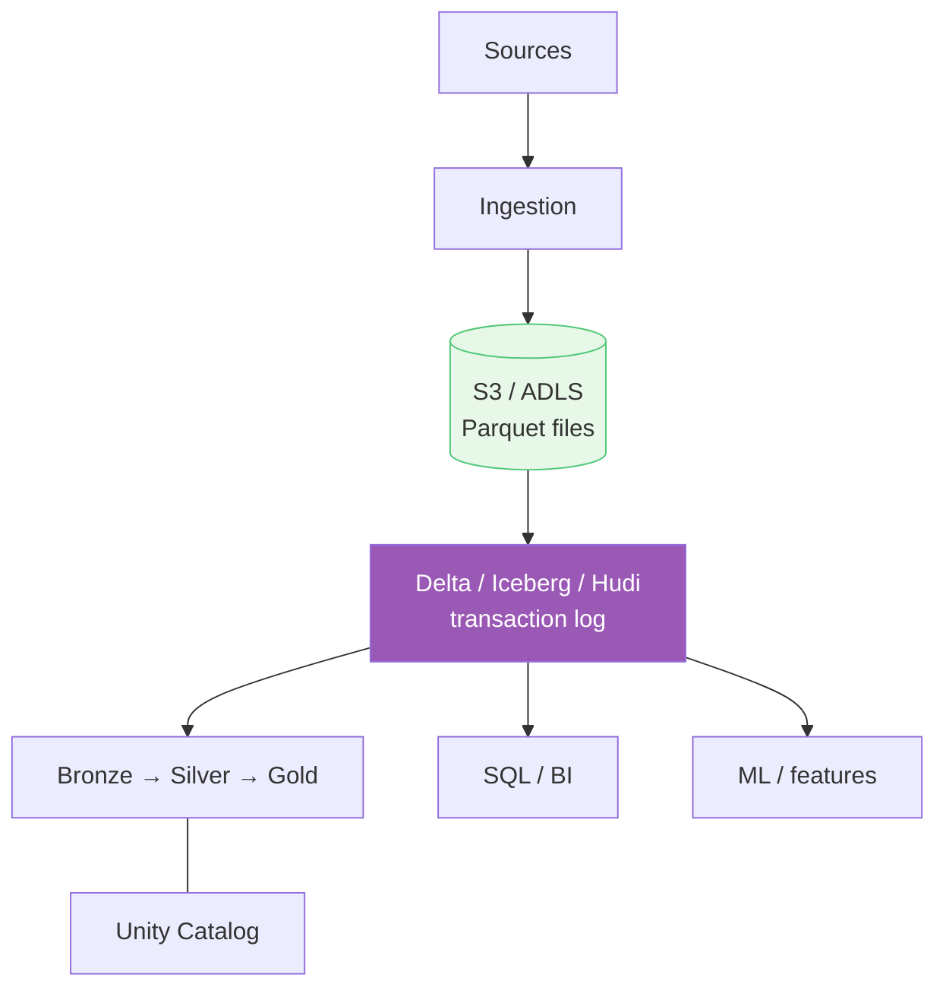
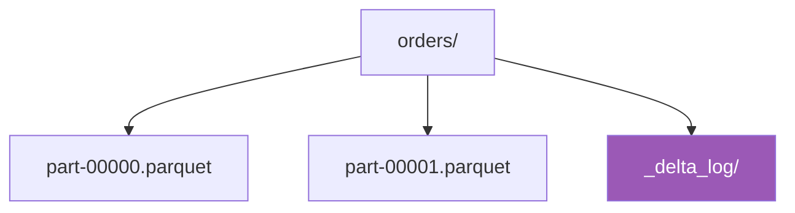
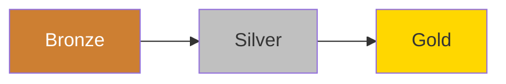
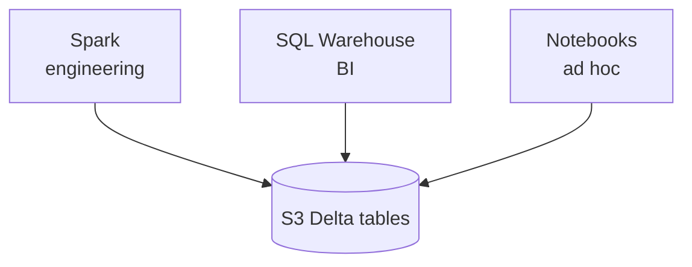

> **Goal:** One copy of data for BI, engineering, and ML - with ACID guarantees on lake storage.  
> **Rule:** The lakehouse fixes the two-tier problem; it does not remove the need for modeling in Gold.

A lakehouse keeps files on cheap object storage but adds **transactional table formats** (Delta Lake, Iceberg, Hudi) and **shared governance** (Unity Catalog, Lake Formation). You get lake economics without maintaining a separate warehouse copy. Background: [Data Warehouse](/data-architecture/data-warehouse/) · [Data Lake](/data-architecture/data-lake/).

---

## Walkthrough: the two-tier problem

Many teams end up running **both**:

- **Snowflake** (or Redshift) for finance dashboards - `fact_orders`, `dim_restaurant`, nightly ETL from Postgres
- **S3 + Spark** for data science - raw clickstreams, driver GPS, A/B test logs

**Pain points that show up in production:**

- Order counts differ between the dashboard and the churn model (two pipelines, two definitions)
- Storage bill pays twice for overlapping history
- Incremental loads to S3 fail mid-write; downstream notebooks read half-updated partitions
- PII policy lives in the warehouse; the lake folder has open read access

**Lakehouse move:** Land Bronze on S3 as **Delta tables**, build Silver/Gold with DLT or Spark, point SQL Warehouse and notebooks at the same Gold `fact_orders`. Unity Catalog holds grants and lineage once.

---

## How it works

### What changed vs plain lake or warehouse

| Lake gap | Lakehouse fix |
|----------|---------------|
| Files in folders | **Tables** with ACID |
| Schema-on-read only | Schema enforcement + evolution |
| Weak catalog | Unity Catalog - grants, lineage |

| Warehouse gap | Lakehouse fix |
|---------------|---------------|
| Expensive storage at PB scale | S3/ADLS pricing |
| ML on a separate copy | Features on same Gold tables |
| Rigid ingest | ELT on elastic Spark/SQL |

Star schema and SCD still live in the **Gold layer** - see [Data Warehouse](/data-architecture/data-warehouse/).

---

## Building blocks

### Open table format (Delta Lake example)

Parquet files plus a `_delta_log/` of JSON commits = atomic writes, time travel, MERGE for CDC.

### Medallion layers

| Layer | Example |
|-------|-------------------|
| **Bronze** | Raw Kafka events, Postgres CDC |
| **Silver** | Deduped orders, typed columns, PII hashed |
| **Gold** | `fact_orders` star schema for BI + ML features |

Pipelines (DLT, Airflow + Spark) enforce the layers - not folder naming alone.

### Shared compute on one storage layer

---

## Databricks as a reference stack

Not the only option, but the names map cleanly:

| Component | Role |
|-----------|------|
| **Delta Lake** | ACID on object storage |
| **Unity Catalog** | Permissions, lineage |
| **Jobs / DLT** | Medallion pipelines |
| **SQL Warehouses** | BI latency on Gold |
| **MLflow** | Models on same data |

---

## Honest trade-offs

- **Ops complexity** - file sizing, `OPTIMIZE`, Z-order, cluster sizing still matter
- **Migration cost** - moving off warehouse-only or swampy S3 takes planning
- **Not magic** - bad Gold modeling still produces bad dashboards

---

## Summary

| Idea | Remember |
|------|----------|
| **Two-tier problem** | Warehouse + lake = duplicate truth |
| **Table format** | Delta/Iceberg turns files into tables |
| **Medallion** | Bronze/Silver/Gold with enforced pipelines |
| **One catalog** | Same grants for BI and ML |

**In interviews, say something like:** *"Lakehouse means Parquet on S3 with ACID and a catalog - not a new database vendor, a storage pattern."*

**Back:** [Overview](/data-architecture/overview/)
