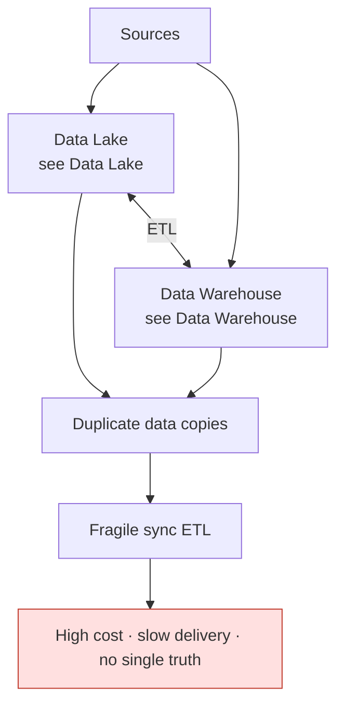
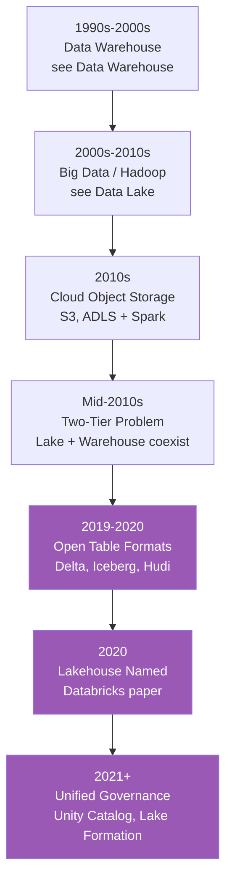
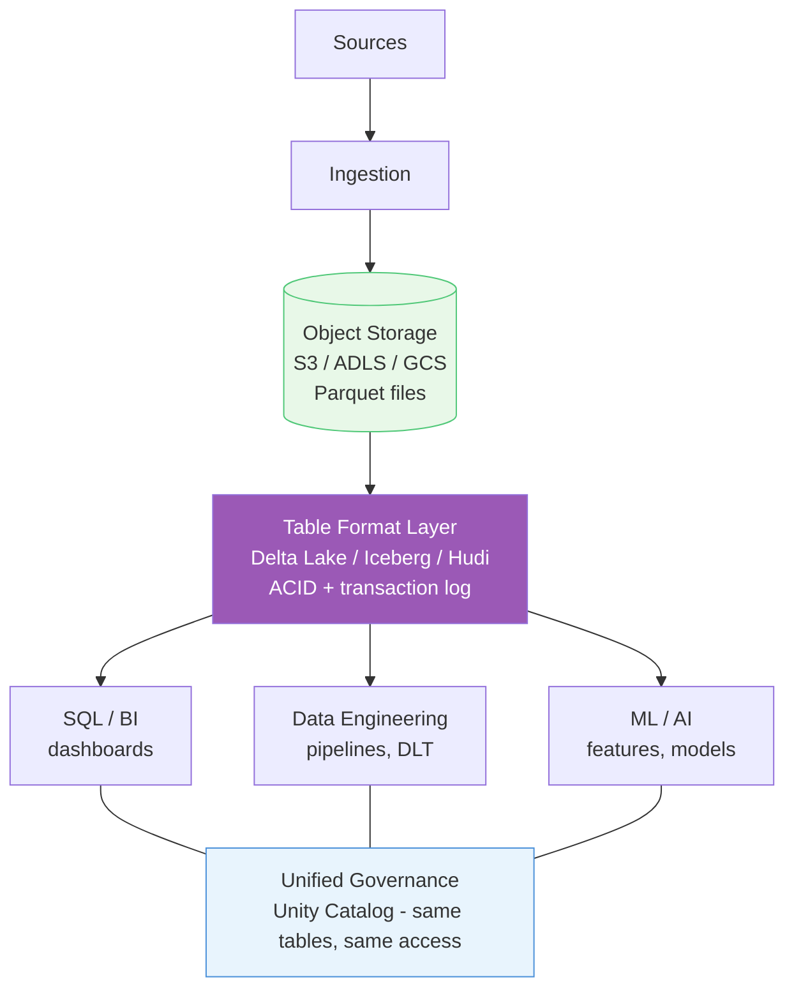
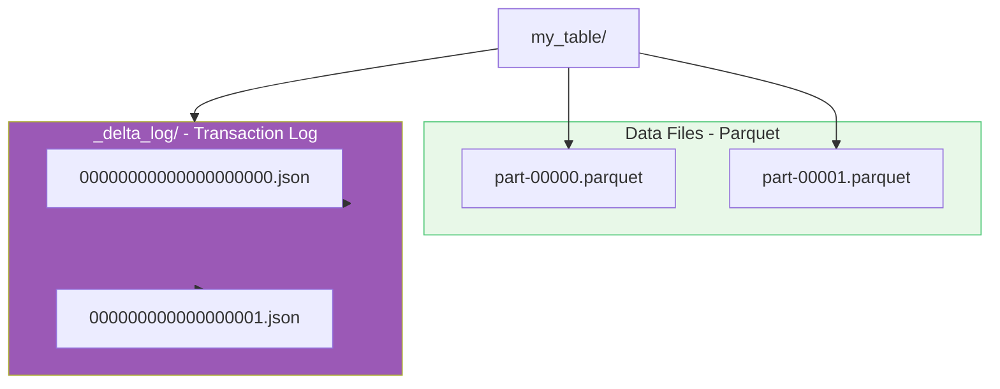
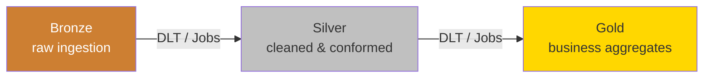
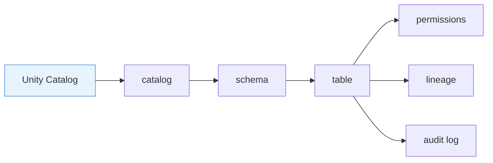
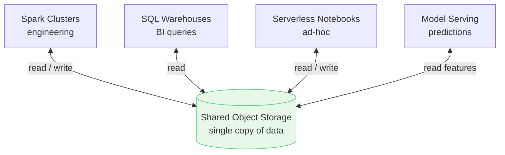
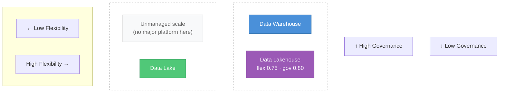

A **data lakehouse** keeps data on lake storage (cheap, scalable object stores) but adds warehouse capabilities: ACID transactions, governance, reliable SQL/BI, and structured modeling - on one platform. Lake economics plus warehouse trust.

See also: [Data Warehouse](/data-architecture/data-warehouse/) · [Data Lake](/data-architecture/data-lake/) · [Overview](/data-architecture/overview/)

---

## What problem it solved

By the late 2010s, many companies had **both** a [data warehouse](/data-architecture/data-warehouse/) and a [data lake](/data-architecture/data-lake/):

Pain points:

- **Two copies** of the same data (storage cost + sync complexity)
- **Two governance models** (who owns the truth?)
- **Slow time-to-value** - [warehouse modeling](/data-architecture/data-warehouse/) delays science; [lake](/data-architecture/data-lake/) lacks BI trust
- **Broken pipelines** (lake files without ACID → unreliable incremental loads)

The lakehouse answered:

> "Keep data on cheap lake storage, but add a transactional, governed layer so BI, engineering, and ML all use the same reliable datasets."

---

## How the lakehouse came to be (evolution)

### Step 1 - Warehouse era (1990s-2000s)
Structured BI on proprietary databases. Details → [Data Warehouse](/data-architecture/data-warehouse/).

### Step 2 - Big Data & Hadoop (2000s-2010s)
HDFS + MapReduce/Spark on commodity hardware. Details → [Data Lake](/data-architecture/data-lake/).

### Step 3 - Cloud object storage (2010s)
S3 and ADLS made lakes cheaper and more durable than HDFS. Spark became the standard processing engine.

### Step 4 - The "two-tier" problem (mid-2010s)
Enterprises ran [lake for ingestion/ML](/data-architecture/data-lake/) and [warehouse for BI](/data-architecture/data-warehouse/), connected by fragile ETL.

### Step 5 - Open table formats (late 2010s-2020s)
Breakthrough: add a **transaction log** on top of Parquet files in object storage.

| Technology | What it added |
|------------|---------------|
| **Delta Lake** (Databricks, 2019) | ACID, time travel, schema enforcement on lake files |
| **Apache Iceberg** (Netflix) | Similar goals, open table format |
| **Apache Hudi** (Uber) | Incremental processing, upserts |

These formats turned "a folder of files" into something that behaves like a database table.

### Step 6 - Lakehouse as a named architecture (2020)
Databricks published the [Lakehouse paper](https://arxiv.org/abs/2007.00000) formalizing the idea: one platform for all workloads on open lake storage.

### Step 7 - Governance catches up (2021+)
**Unity Catalog**, **AWS Lake Formation**, and similar tools brought warehouse-grade access control, lineage, and discovery to lake data.

---

## How it works (architecture)

### What the lakehouse adds (vs plain lake and vs warehouse)

| Gap from [data lake](/data-architecture/data-lake/) | Lakehouse fix |
|--------------------------------------|---------------|
| Files in folders | **Tables** with ACID guarantees |
| Schema-on-read only | **Schema enforcement** + evolution |
| Manual quality checks | Built-in **expectations** and monitoring |
| Weak catalog | **Unity Catalog** - grants, lineage, discovery |

| Gap from [data warehouse](/data-architecture/data-warehouse/) | Lakehouse fix |
|------------------------------------------------|---------------|
| Expensive proprietary storage | **Cheap object storage** (S3/ADLS) |
| Cannot store unstructured / ML data easily | **All data types** on one platform |
| Separate copy for ML workloads | **Feature store + MLflow** on same data |
| Rigid ETL before any use | **ELT** on elastic compute |

> Warehouse modeling (star schema, OLTP/OLAP, SCD) still applies in the Gold layer - see [Data Warehouse](/data-architecture/data-warehouse/).

---

## Core building blocks

### 1. Open table format (the technical foundation)
Example with **Delta Lake**:

The log enables:
- Atomic writes (all-or-nothing)
- Concurrent reads during writes
- Time travel (query yesterday's version)
- MERGE / UPSERT for CDC

### 2. Medallion architecture (organizational pattern)
Structured quality layers on lake storage:

Now enforced by pipelines (e.g., Delta Live Tables), not just folder naming.

### 3. Unified governance
One metastore governs tables, files, models, and features:

### 4. Separate compute, shared storage
Different engines attach to the same tables:

- Spark clusters for engineering
- SQL warehouses for BI
- Serverless for ad-hoc notebooks
- Model serving for predictions

Storage stays in the lake; compute scales independently.

---

## How lakehouse compares

Full warehouse notes: [Data Warehouse](/data-architecture/data-warehouse/). Full lake notes: [Data Lake](/data-architecture/data-lake/). Below is the lakehouse angle only.

How the three patterns compare on flexibility (horizontal) vs governance (vertical):

| Platform | Flexibility | Governance | Where to read more |
|----------|-------------|------------|-------------------|
| **Data Warehouse** | Low (0.25) | High (0.85) | [Data Warehouse](/data-architecture/data-warehouse/) |
| **Data Lake** | High (0.85) | Low (0.20) | [Data Lake](/data-architecture/data-lake/) |
| **Data Lakehouse** | High (0.75) | High (0.80) | here |

**Reading the map:** top-left is the warehouse, bottom-right is the lake, top-right is the lakehouse - flexibility without giving up governance. Bottom-left is the gap the lakehouse was meant to close.

### Lakehouse capability summary

| Capability | Warehouse | Lake | Lakehouse |
|------------|-----------|------|-----------|
| Cheap object storage | No | Yes | Yes |
| ACID transactions | Yes | No | Yes |
| All data types | Limited | Yes | Yes |
| Fast BI / SQL | Yes | Poor | Yes (with optimization) |
| ML on same data | No (usually) | Yes | Yes |
| Strong governance | Yes | Weak | Yes |
| Open formats | Often proprietary | Yes (files) | Yes (Delta/Iceberg) |

---

## Example: Databricks

Databricks built around the lakehouse model from the start:

| Databricks component | Lakehouse role |
|---------------------|----------------|
| **Delta Lake** | ACID tables on object storage |
| **Unity Catalog** | Governance and lineage |
| **Jobs / DLT** | Reliable medallion pipelines |
| **SQL Warehouses** | Warehouse-speed analytics on lake tables |
| **MLflow / Feature Store** | ML lifecycle on the same data |

---

## Trade-offs

The lakehouse is not a silver bullet:

- **Complexity** - table formats, cluster tuning, and governance still require skilled teams
- **Performance tuning** - `OPTIMIZE`, Z-ordering, and file sizing matter for SQL speed
- **Migration effort** - moving from legacy warehouse-only or swampy lakes takes planning
- **Ecosystem maturity** - catching up to decades of warehouse tooling, but moving fast

---

**Takeaway:** A lakehouse keeps data on cheap lake storage but adds transactional table formats and unified governance so analytics, engineering, and ML share one reliable copy.

**Back:** [Overview](/data-architecture/overview/)
