> **Scope:** This document is the **only** place for data warehouse topics — OLTP/OLAP, ETL/ELT, dimensional modeling, star/snowflake schema, SCD, Kimball/Inmon, columnar/MPP, and warehouse platforms (Snowflake, BigQuery, etc.).
>
> For **data lakes** → [Data Lake](/data-architecture/data-lake/) · For **lakehouse** → [Data Lakehouse](/data-architecture/data-lakehouse/) · For a **three-way overview** → [Overview](/data-architecture/overview/)

A **data warehouse** is a centralized system designed to store **structured, cleaned, business-ready data** and serve **fast analytics** — especially SQL queries, dashboards, and reports.

Think of it as the **single source of truth for business metrics**: revenue, orders, customers, inventory, KPIs.

---

## Table of Contents

1. [What problem it solved](#what-problem-it-solved)
2. [How it works (architecture)](#how-it-works-architecture)
3. [Component map](#component-map)
4. [OLTP vs OLAP](#oltp-vs-olap)
5. [ETL vs ELT](#etl-vs-elt)
6. [Dimensional modeling](#dimensional-modeling)
7. [Fact tables](#fact-tables)
8. [Dimension tables](#dimension-tables)
9. [Star schema](#star-schema)
10. [Snowflake schema](#snowflake-schema)
11. [Star vs Snowflake](#star-vs-snowflake)
12. [Grain, keys & SCD](#grain-keys--slowly-changing-dimensions)
13. [Kimball vs Inmon](#kimball-vs-inmon)
14. [Data marts & conformed dimensions](#data-marts--conformed-dimensions)
15. [Why warehouses are fast](#why-warehouses-are-fast)
16. [Core characteristics](#core-characteristics)
17. [Strengths & limitations](#strengths--limitations)
18. [Warehouse technologies](#warehouse-technologies)
19. [Review summary](#review-summary)

---

## What problem it solved

Before warehouses, every department had its own spreadsheets and databases. Numbers did not match. Reports were slow and inconsistent.

The warehouse answered:

> "Give business users one reliable place to query consistent, historical data for decision-making."

---

## How it works (architecture)

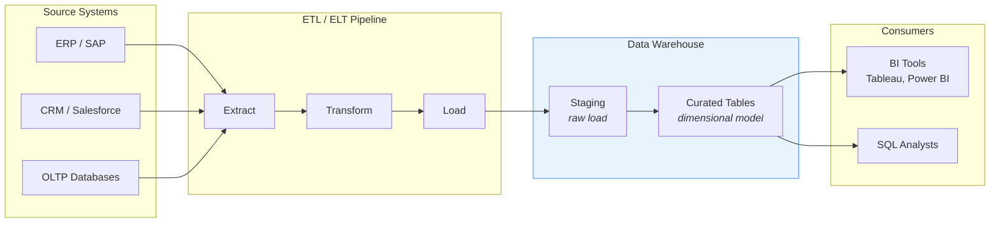

### Key components

| Component | Role |
|-----------|------|
| **Source systems** | Operational databases, apps, ERP/CRM — where transactions happen |
| **ETL / ELT** | Extract data, transform it to a standard model, load into the warehouse |
| **Staging area** | Temporary landing zone before data is cleaned |
| **Dimensional model** | Star/snowflake schema — **facts** (metrics) and **dimensions** (context) |
| **OLAP engine** | Optimized for analytical queries (aggregations, joins across large history) |
| **BI layer** | Dashboards and reports on top |

---

## Component map

For the **full end-to-end diagram** — all layers, all paradigms, fact/dimension seating, and lakehouse wiring — see **[Architecture Map](/data-architecture/architecture-map/)**.

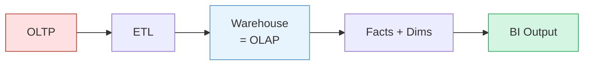

---

## OLTP vs OLAP

These are the two fundamental database workloads. A data warehouse is an **OLAP** system. It is fed by **OLTP** systems but never replaces them.

### Simple mental model

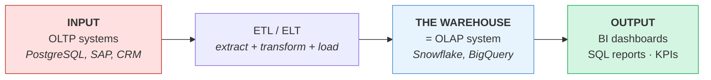

| Role | What it is | Example |
|------|------------|---------|
| **OLTP = input (source)** | Where live business transactions happen | App writes `INSERT INTO orders` to PostgreSQL |
| **Warehouse = OLAP (the store)** | The analytics database itself — **not** the output | Snowflake holds years of sales in a star schema |
| **BI / reports = output (consumers)** | What people actually read | `SUM(revenue) BY region` in Tableau or Power BI |

OLAP is not the output — the **warehouse is the OLAP system**. Dashboards, reports, and analyst queries are the output; they read *from* the warehouse.

**One-line flow:** `OLTP (input) → ETL → Warehouse/OLAP (store) → BI (output)`

### In plain English

| | OLTP | OLAP (the warehouse) |
|---|------|----------------------|
| **What it holds** | Day-to-day **transaction** data | **Informational** schema — history, trends, patterns |
| **Purpose** | **Run** the business right now | **Understand** the business over time |
| **Question it answers** | "Process this order." "Update this balance." | "What trend do we see?" "Which region grew?" "What pattern predicts churn?" |
| **Time horizon** | Today — live, current state | Months and years of history |
| **Who uses it** | Applications, cashiers, customers | Analysts, executives, data scientists |
| **Data shape** | Normalized rows (one fact, no duplication) | Star/snowflake (facts + dimensions for easy slicing) |

**OLTP** = the **operational engine** — every sale, login, and payment as it happens.

**OLAP** = the **analytical lens** — cleaned, modeled data so you can spot trends, compare periods, build forecasts, and train models on consistent history.

Both are essential. OLTP keeps the business running; OLAP helps you decide where to take it.

### Side-by-side comparison

| Dimension | OLTP | OLAP |
|-----------|------|------|
| **Full name** | Online Transaction Processing | Online Analytical Processing |
| **Purpose** | Run the business (orders, payments, logins) | Analyze the business (reports, trends, KPIs) |
| **Query pattern** | Many small, fast reads/writes | Few large, complex reads (aggregations) |
| **Data scope** | Current state (today's orders) | Historical (all orders since 2010) |
| **Users** | Applications, customers, staff | Analysts, executives, data teams |
| **Schema** | Highly normalized (3NF) — reduce redundancy | Denormalized (star/snowflake) — optimize reads |
| **Data changes** | Constant inserts/updates/deletes | Mostly bulk loads; occasional updates |
| **Example systems** | PostgreSQL, MySQL, SQL Server, Oracle OLTP | Snowflake, BigQuery, Redshift, Teradata |
| **Example query** | `INSERT INTO orders ...` | `SELECT region, SUM(revenue) GROUP BY region` |

### OLTP — how the business runs

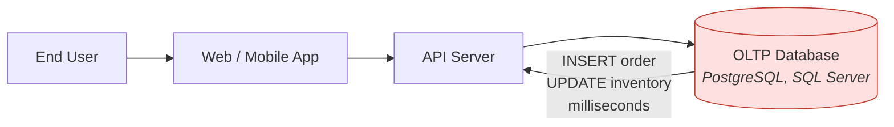

**Characteristics:**
- Optimized for **row-based** storage (fetch one order + its line items quickly)
- **Short transactions** — commit or rollback in milliseconds
- **Normalized schema** — data stored once, no duplication (3rd Normal Form)
- **High concurrency** — thousands of users hitting the DB at once
- **Data is live** — reflects the current moment

### OLAP — how the business is understood

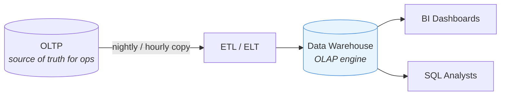

**Characteristics:**
- Optimized for **columnar** storage (scan one column across millions of rows fast)
- **Heavy reads** — `SUM`, `AVG`, `COUNT`, `GROUP BY`, window functions
- **Denormalized schema** — star/snowflake for fewer joins at query time
- **Historical data** — years of history kept for trend analysis
- **Batch or micro-batch loads** — not designed for per-click inserts

### Why you must keep them separate

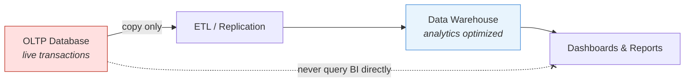

| If you query OLTP for BI... | What happens |
|-----------------------------|--------------|
| Run `SUM(revenue) GROUP BY month` on production | Locks tables, slows checkout for customers |
| Scan 5 years of history | OLTP indexes are not built for full-table scans |
| Join 10 tables for a dashboard | Normalized OLTP schema requires many expensive joins |

**Rule:** OLTP runs operations. OLAP runs analytics. Data flows one way: **OLTP → Warehouse → BI**.

---

## ETL vs ELT

Both move data from sources into the warehouse. The difference is **where transformation happens**.

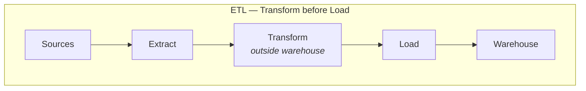

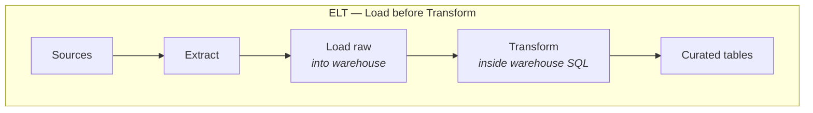

| | ETL | ELT |
|---|-----|-----|
| **Transform where** | External tool (Informatica, SSIS, Airflow) | Inside the warehouse (SQL, dbt) |
| **When dominant** | Traditional on-prem era | Modern cloud warehouses |
| **Best when** | Limited warehouse compute; heavy cleansing needed pre-load | Warehouse has elastic compute (Snowflake, BigQuery) |
| **Examples** | Informatica, Talend, DataStage | dbt, Spark SQL, native warehouse SQL |

Cloud warehouses (Snowflake, BigQuery, Databricks SQL) strongly favor **ELT** — load raw data fast, then transform with the warehouse's own compute power.

---

## Dimensional modeling

The standard way to design a warehouse schema for BI. Created by **Ralph Kimball**.

**Core idea:** Organize data into two types of tables:

| Type | Question it answers | Contains |
|------|---------------------|----------|
| **Fact table** | *What happened? How much?* | Numbers (metrics/measures) + foreign keys |
| **Dimension table** | *Who? What? Where? When? Why?* | Descriptive attributes (text, categories) |

### Fact vs dimension — in simple terms

Think of a **spreadsheet of sales**:

| Date | Product | Customer | City | **Amount** | **Qty** |
|------|---------|----------|------|------------|---------|
| Jan 5 | iPhone | John | NYC | **$999** | **1** |
| Jan 5 | Case | Sarah | LA | **$29** | **2** |

- **Fact table** = the **numbers** and the **event** — *how much* was sold, *how many* units. One row per sale.
- **Dimension tables** = the **labels** you filter and group by — *when* (date), *what* (product), *who* (customer), *where* (city).

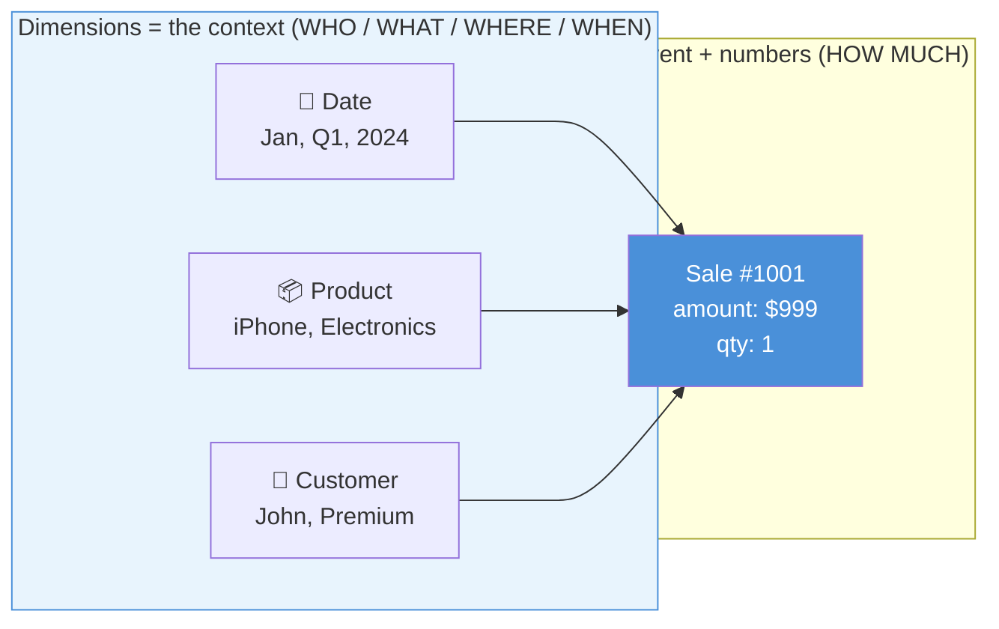

| | Fact | Dimension |
|---|------|-----------|
| **Simple role** | The **measurement** | The **description** |
| **Contains** | Numbers you sum (`amount`, `quantity`, `profit`) | Text/categories you filter by (`region`, `brand`, `month`) |
| **Row means** | One **event** happened | One **thing** exists (one product, one customer, one date) |
| **Analogy** | The **score** in a game log | The **player name, team, date** around that score |
| **In a query** | `SUM(amount)`, `COUNT(*)` | `WHERE region = 'NYC'`, `GROUP BY category` |

**One line:** Dimensions tell you **what you're looking at**; facts tell you **what happened and how much**.

### iPhone example

| Table | Role | iPhone example |
|-------|------|----------------|
| **`dim_product`** | **What** types exist | iPhone 15, iPhone 14 Pro, iPhone SE — name, storage, color |
| **`dim_date`** | **When** | 2024, Q1, January — the time labels you group by |
| **`fact_sales`** | **How many / how much** | 500 units, $499,500 revenue — the actual numbers |

**Question → which table:**

| Business question | Where the answer lives |
|-------------------|------------------------|
| "How many iPhones did we sell last year?" | **`fact_sales`** → `SUM(quantity)` filtered by `dim_date` |
| "What iPhone models do we sell?" | **`dim_product`** → list of types (no counts) |
| "How many **iPhone 15 Pro** in **2024**?" | Join **`fact_sales`** + **`dim_product`** + **`dim_date`** |

The dimension stores **what types exist**, not yearly totals. Counts live in **`fact_sales`**; **`dim_date`** provides the year filter; **`dim_product`** provides the model breakdown.

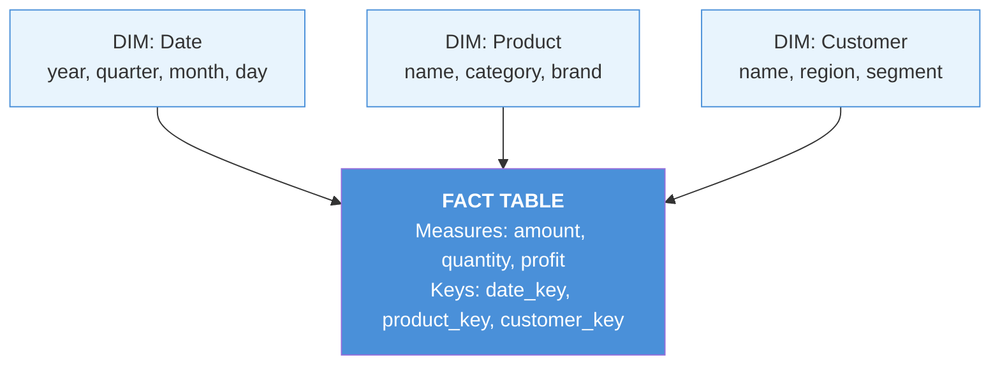

**Analyst query pattern:**
```sql
SELECT d.month, p.category, SUM(f.amount)
FROM   fact_sales f
JOIN   dim_date     d ON f.date_key     = d.date_key
JOIN   dim_product  p ON f.product_key  = p.product_key
GROUP BY d.month, p.category
```

---

## Fact tables

The center of the dimensional model. Stores **business events** or **snapshots** at a defined **grain**.

### Types of fact tables

| Type | Description | Example |
|------|-------------|---------|
| **Transaction fact** | One row per business event | One row per sale, per click, per shipment |
| **Periodic snapshot** | One row per entity per time period | Daily account balance, end-of-week inventory |
| **Accumulating snapshot** | One row per process lifecycle, updated as stages complete | Order fulfillment: ordered → shipped → delivered |
| **Factless fact** | Records an event with no numeric measure | Student attended class (yes/no event) |

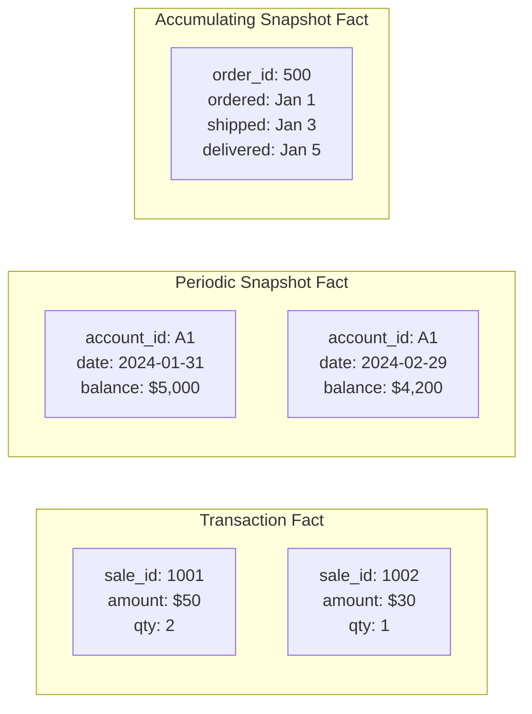

### Fact table anatomy

| Column type | Example | Purpose |
|-------------|---------|---------|
| **Foreign keys** | `date_key`, `product_key`, `customer_key` | Link to dimensions |
| **Measures (additive)** | `amount`, `quantity`, `cost` | Can be summed across any dimension |
| **Measures (semi-additive)** | `account_balance`, `inventory_level` | Can be summed across some dimensions, not time |
| **Measures (non-additive)** | `unit_price`, `margin_pct` | Cannot be summed — use AVG or recalculate |
| **Degenerate dimension** | `order_number`, `invoice_id` | Dimension attribute stored in fact (no separate dim table) |

---

## Dimension tables

Descriptive context for facts. Answer the **who, what, where, when, why, how** questions.

### Common dimension types

| Dimension | Attributes |
|-----------|------------|
| **Date / Time** | year, quarter, month, week, day, is_holiday, fiscal_period |
| **Customer** | name, email, segment, region, acquisition_date |
| **Product** | name, SKU, category, subcategory, brand, color |
| **Store / Location** | city, state, country, store_type, manager |
| **Employee** | name, department, title, hire_date |
| **Promotion** | promo_name, discount_type, start_date, end_date |

### Surrogate keys

Dimensions use a **surrogate key** (integer) instead of the natural business key:

```
Natural key:  customer_email = "john@acme.com"  (can change!)
Surrogate key: customer_key = 1042              (never changes)
```

**Why:** Business keys change (email updates, product renames). Surrogate keys keep fact table joins stable across history.

---

## Star schema

The simplest and most common dimensional model. One **fact table** in the center, **dimension tables** radiating out like a star.

### In simple terms

Picture a **wheel**: the **fact table** is the hub; each **dimension** is a spoke.

```
                    dim_date
                       |
    dim_customer — fact_sales — dim_product
                       |
                    dim_store
```

Every dimension is **one flat table** with all its details in a single place:

| dim_product (one flat table) |
|------------------------------|
| iPhone 15 Pro |
| category: **Electronics** |
| subcategory: **Phones** |
| brand: **Apple** |

| dim_customer (one flat table) |
|-------------------------------|
| John Smith |
| region: **NYC** |
| segment: **Premium** |

**How a report works:** join `fact_sales` to the dimensions you need, then sum.

```sql
SELECT p.category, SUM(f.amount)
FROM   fact_sales f
JOIN   dim_product p ON f.product_key = p.product_key
GROUP BY p.category
```

One join to `dim_product` — category is already inside it.

| Star schema | Meaning |
|-------------|---------|
| **Shape** | Fact in the center, dimensions around it ★ |
| **Dimension tables** | Flat and wide — all attributes in one table |
| **Joins** | Few (fact → dim) — fast and simple |
| **Best for** | BI dashboards, analysts, most modern warehouses |
| **Trade-off** | Some repeated text (e.g. "Electronics" on every phone row) |

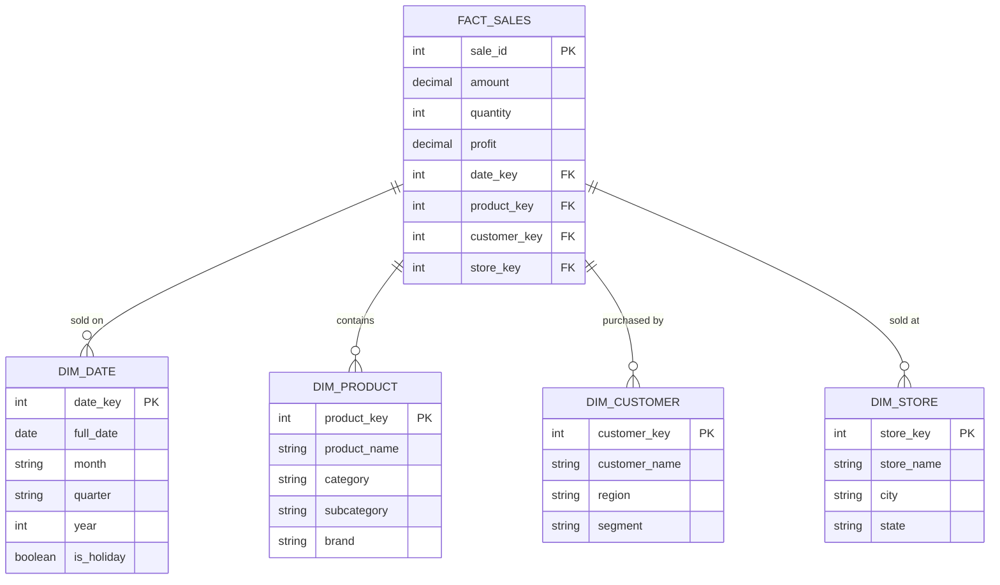

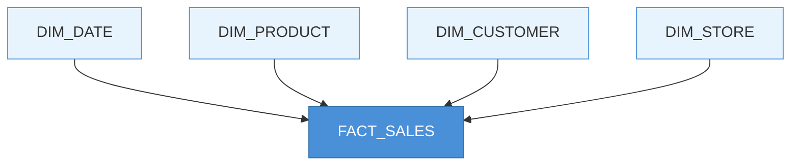

**Properties:**
- Dimensions are **denormalized** — all attributes in one flat table (category and subcategory both in `dim_product`)
- Queries need **few joins** — fact + 2–4 dimensions = fast BI
- Easy for analysts to understand — looks like a star, hence the name
- Most common in modern cloud warehouses and BI tools

---

## Snowflake schema

A **normalized version of the star schema**. Dimension tables are split into **sub-dimensions** to reduce redundancy.

### In simple terms

**Both star and snowflake have a fact table.** The fact table is identical in role — it holds the numbers (amount, quantity). Only the **dimension layout** changes: flat in a star, split into sub-tables in a snowflake.

Same fact table in the center — dimensions **branch out** like a snowflake ❄ instead of sitting flat.

**Star** — everything about a product in one table:

```
dim_product
├── iPhone 15 Pro
├── category: Electronics      ← repeated on every product row
├── subcategory: Phones
└── brand: Apple
```

**Snowflake** — split into linked sub-tables so "Electronics" is stored once:

```
dim_department          dim_category           dim_product
├── Electronics    ←──  ├── Phones       ←──  ├── iPhone 15 Pro
                          ├── Tablets           ├── iPad Air
                          └── Laptops           └── MacBook Pro
```

To get `category` for a sale, the query chains through more tables:

```sql
SELECT c.category_name, SUM(f.amount)
FROM   fact_sales f
JOIN   dim_product  p ON f.product_key  = p.product_key
JOIN   dim_category c ON p.category_key = c.category_key   -- extra join
GROUP BY c.category_name
```

| Snowflake schema | Meaning |
|------------------|---------|
| **Shape** | Fact in center, dimensions split into hierarchies ❄ |
| **Dimension tables** | Normalized — split into sub-tables (product → category → department) |
| **Joins** | More (fact → dim → sub-dim → sub-sub-dim) |
| **Best for** | Saving storage when dimensions have deep hierarchies |
| **Trade-off** | Harder to write queries; slower joins |

Use when a dimension has **repeating groups** that would waste storage if kept flat.

**Example:** `dim_product` contains `category` and `subcategory`. In a star, every product row repeats the category name. In a snowflake, category is its own table.

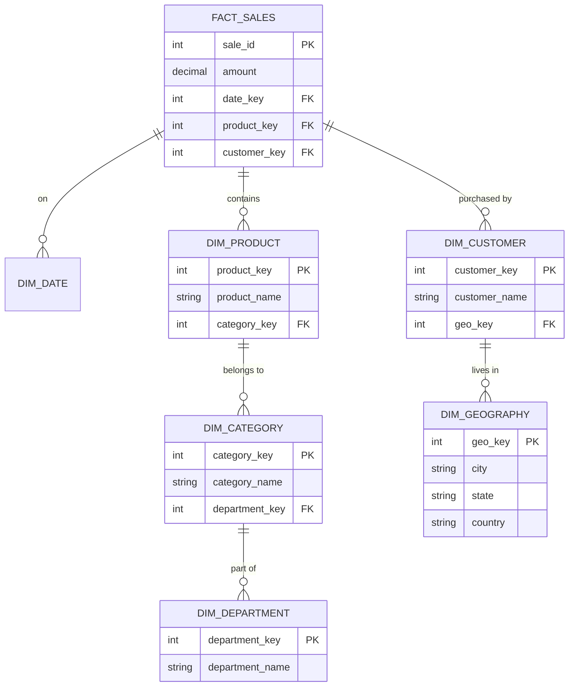

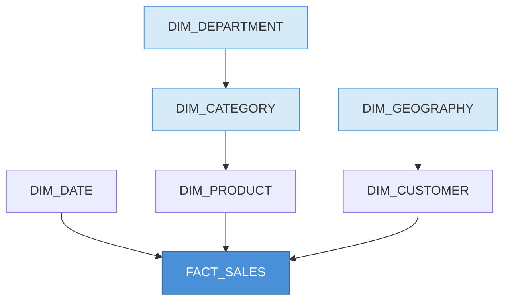

**Properties:**
- Dimensions are **partially normalized** — split into hierarchy levels
- More joins at query time (fact → product → category → department)
- Less storage duplication
- More complex for analysts; less common in modern cloud warehouses (compute is cheap, storage is cheap — star wins)

**Snowflake schema** is a dimensional modeling pattern from the 1990s. It is unrelated to **Snowflake** the cloud data platform, which supports both star and snowflake schemas.

---

## Star vs Snowflake

### In simple terms — one analogy

Both layouts answer the same question: *"How do I connect sales numbers to product, customer, and date?"*

| | Star ★ | Snowflake ❄ |
|---|--------|---------------|
| **Fact table** | Yes — center of the model | Yes — same role, same place |
| **Like organizing…** | One big folder per topic | Subfolders within folders |
| **dim_product** | One table with name + category + brand | `dim_product` → `dim_category` → `dim_department` |
| **Query** | `fact` → `dim_product` (1 join) | `fact` → `dim_product` → `dim_category` (2+ joins) |
| **Storage** | "Electronics" repeated on every row | "Electronics" stored once |
| **Used today** | Default choice (~90% of warehouses) | Rare — storage is cheap; simplicity wins |

**Rule of thumb:** start with a **star**. Split into a **snowflake** only when a dimension is huge and repetition is costly.

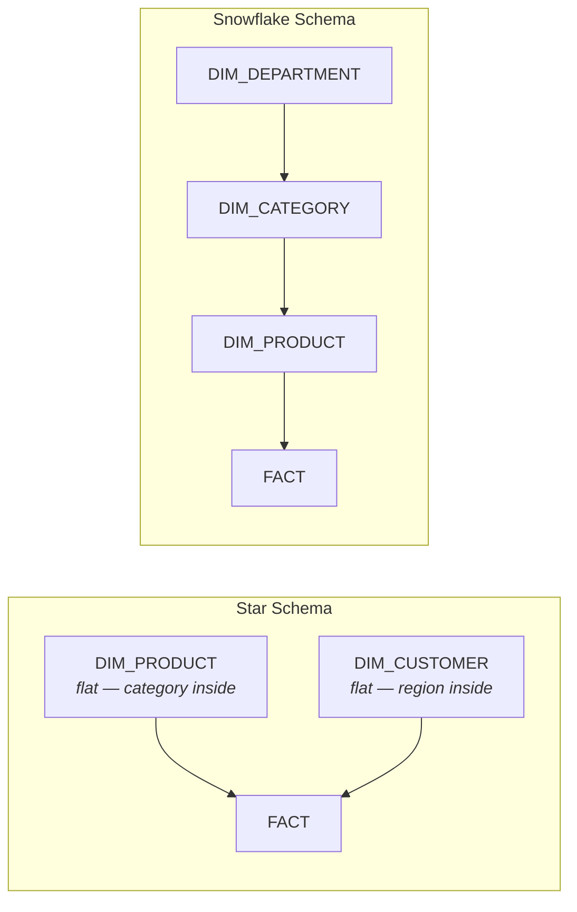

| Dimension | Star Schema | Snowflake Schema |
|-----------|-------------|------------------|
| **Structure** | Flat, denormalized dimensions | Normalized, split dimensions |
| **Joins** | Fewer (faster queries) | More (slower queries) |
| **Storage** | More duplication | Less duplication |
| **Complexity** | Simple for analysts | Harder to navigate |
| **Usage today** | Default choice (90%+) | Legacy / storage-sensitive cases |
| **Shape** | Star ★ | Snowflake ❄ (branched hierarchy) |

---

## Grain, keys & Slowly Changing Dimensions

### Grain

**Grain** defines what one row in a fact table represents. It must be declared explicitly.

| Grain statement | Meaning |
|-----------------|---------|
| "One row per order line item" | Each row = one product within one order |
| "One row per customer per day" | Periodic snapshot — daily customer state |
| "One row per web click" | Transaction fact — every click event |

**Rule:** Once grain is set, all measures must be consistent with it. You cannot mix order-level and line-item-level metrics in the same fact table.

### Slowly Changing Dimensions (SCD)

Dimension attributes change over time (customer moves cities, product changes category). SCD strategies define how to handle history:

| Type | Strategy | Example | History kept? |
|------|----------|---------|---------------|
| **SCD Type 0** | Keep original forever | Social Security number | No — never update |
| **SCD Type 1** | Overwrite old value | Fix typo in customer name | No |
| **SCD Type 2** | Add new row with new key | Customer moves from NY → CA | Yes — full history |
| **SCD Type 3** | Add column for previous value | Store current + previous region | Partial — one prior value |

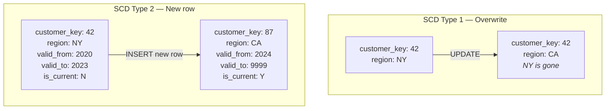

**SCD Type 2** is the most common in warehouses when historical accuracy matters ("What region was this customer in when they placed the order in 2022?").

---

## Kimball vs Inmon

Two competing warehouse design philosophies:

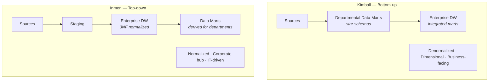

| Dimension | Kimball | Inmon |
|-----------|---------|-------|
| **Approach** | Bottom-up — build marts first, integrate later | Top-down — build one normalized hub first |
| **Schema** | Star/snowflake (dimensional) | 3rd Normal Form (normalized) |
| **Speed to value** | Fast — first mart in weeks | Slow — enterprise model takes months |
| **Integration** | Conformed dimensions across marts | Central EDW feeds all marts |
| **Champion** | Ralph Kimball | Bill Inmon |
| **Dominant today** | Yes — Kimball-style dimensional modeling is the standard | Less common for new builds |

---

## Data marts & conformed dimensions

### Data mart

A **subset of the warehouse** focused on one business area:

| Data mart | Serves | Example tables |
|-----------|--------|----------------|
| **Sales mart** | Sales team | `fact_sales`, `dim_product`, `dim_customer` |
| **Finance mart** | Finance team | `fact_gl`, `dim_account`, `dim_cost_center` |
| **Marketing mart** | Marketing team | `fact_campaign`, `dim_channel`, `dim_audience` |

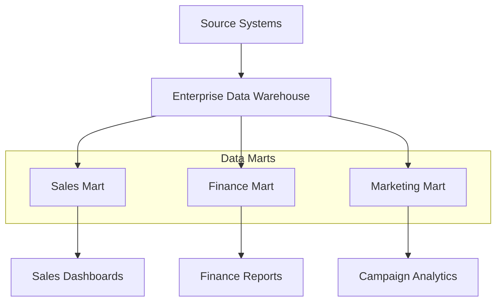

### Conformed dimensions

The same dimension table (same keys, same attributes) shared across multiple marts. This is how Kimball achieves enterprise consistency:

```
dim_date     →  used by Sales mart AND Finance mart AND Marketing mart
dim_customer →  same customer_key means the same customer everywhere
```

Without conformed dimensions, "customer count" in Sales and Marketing will never match.

---

## Why warehouses are fast

### Columnar storage

Traditional OLTP databases store data **row by row**. Warehouses store data **column by column**.

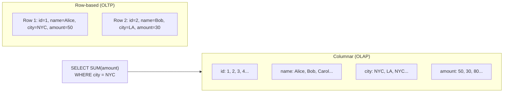

For `SUM(amount) WHERE city = 'NYC'`, columnar storage reads **only** the `amount` and `city` columns — skipping name, id, and everything else. Massive I/O savings.

### MPP (Massively Parallel Processing)

Large warehouses split queries across many nodes:

```mermaid
flowchart TD
    QUERY["SELECT region, SUM(revenue)<br/>GROUP BY region"]
    COORD["Coordinator<br/><i>query planner</i>"]
    N1["Node 1<br/>scans rows A–M"]
    N2["Node 2<br/>scans rows N–Z"]
    RESULT["Merged result"]

    QUERY --> COORD
    COORD --> N1
    COORD --> N2
    N1 --> RESULT
    N2 --> RESULT
```

Each node processes its slice of data in parallel. Results are merged. This is how warehouses scan billions of rows in seconds.

### Other optimizations

| Technique | What it does |
|-----------|--------------|
| **Compression** | Columnar data compresses well (repeated values) — less disk I/O |
| **Zone maps / sorting** | Data physically sorted by common filter columns (date, region) — skip irrelevant blocks |
| **Materialized views** | Pre-computed aggregations — instant dashboard queries |
| **Result caching** | Identical queries return cached results without re-scanning |
| **Query optimizer** | Cost-based planner picks the fastest join/scan strategy |

---

## Core characteristics

### 1. Schema-on-write
Data must match a defined schema **before** it is stored. Bad or unexpected data is rejected or fixed during ETL/ELT.

```mermaid
flowchart LR
    SRC["Source row<br/><i>messy / varied</i>"]
    ETL["Transform + Validate<br/><i>schema enforced</i>"]
    TBL["Warehouse Table<br/><i>fixed columns</i>"]
    SRC --> ETL --> TBL

    style ETL fill:#FFF3CD,stroke:#856404
```

### 2. Structured data (mostly)
Warehouses excel at **tabular** data. Logs, images, and nested JSON are a poor fit without preprocessing.

### 3. ACID transactions
Reliable inserts, updates, and deletes. Concurrent readers and writers do not corrupt data.

### 4. Historical persistence
Unlike OLTP (which may purge old data), warehouses keep **years of history** for trend analysis and compliance.

### 5. Separation from operational systems
The warehouse is always a **downstream copy** — never the system of record for live transactions.

---

## Strengths & limitations

### Strengths

- **Trusted metrics** — one governed model for the business
- **Fast SQL / BI** — built for dashboards and ad-hoc analysis
- **Mature ecosystem** — decades of tooling, skills, and patterns
- **Strong governance** — roles, row-level security, audit trails
- **Dimensional models** — intuitive for analysts (star schema)

### Limitations (why lakes appeared)

| Limitation | Impact |
|------------|--------|
| **Cost** | Proprietary storage and compute scale expensively with data volume |
| **Rigid schema** | Hard to ingest IoT, clickstreams, JSON APIs, or ML training data |
| **ETL bottleneck** | Every new source needs modeling before anyone can use it |
| **Duplicate data** | Same data copied again into a lake or ML platform |
| **ML unfriendly** | Not designed for feature engineering, model training, or unstructured data |

---

## Warehouse technologies

### Cloud data warehouses

| Platform | Vendor | Architecture highlights |
|----------|--------|------------------------|
| **Snowflake** | Snowflake Inc. | Separates storage/compute/services; multi-cluster; near-zero management |
| **Google BigQuery** | Google | Serverless; petabyte-scale; pay-per-query; columnar |
| **Amazon Redshift** | AWS | MPP columnar; RA3 nodes with managed storage; Spectrum for S3 |
| **Azure Synapse** | Microsoft | Unified analytics; dedicated SQL pools + serverless SQL + Spark |
| **Databricks SQL** | Databricks | Lakehouse — SQL warehouses query Delta tables on object storage |

### Snowflake (platform) — architecture

```mermaid
flowchart TD
    subgraph SF["Snowflake Architecture"]
        STORAGE["Cloud Storage<br/><i>S3 / ADLS / GCS</i><br/>micro-partitions, columnar"]
        COMPUTE["Virtual Warehouses<br/><i>independent compute clusters</i>"]
        SERVICES["Cloud Services<br/><i>auth, optimizer, metadata</i>"]
    end

    USERS["Users / BI Tools"] --> SERVICES
    SERVICES --> COMPUTE
    COMPUTE <-->|"read / write"| STORAGE

    style STORAGE fill:#E8F8E8,stroke:#50C878
    style COMPUTE fill:#E8F4FD,stroke:#4A90D9
    style SERVICES fill:#F0E6FF,stroke:#9B59B6
```

**Key Snowflake concepts:**

| Concept | Description |
|---------|-------------|
| **Virtual Warehouse** | Independent compute cluster — scale up/down, suspend/resume |
| **Micro-partitions** | Automatic data partitioning (50–500 MB chunks) — no manual tuning |
| **Time Travel** | Query data as it existed in the past (up to 90 days) |
| **Zero-copy cloning** | Instant copy of database/table without duplicating storage |
| **Data sharing** | Share live data with other Snowflake accounts without copying |
| **Separation of storage & compute** | Pay for storage and compute independently |

### On-prem (classic)

| Platform | Notes |
|----------|-------|
| **Teradata** | Pioneer of MPP warehousing; strong in large enterprises |
| **Oracle Exadata** | Hybrid row/columnar; common in Oracle-heavy shops |
| **IBM Netezza** | Appliance-based MPP; acquired by IBM |
| **SQL Server Analysis Services** | Microsoft's OLAP/cube engine |

### Modeling & tooling

| Tool / Pattern | Role |
|----------------|------|
| **Kimball dimensional modeling** | Star/snowflake schema design methodology |
| **Inmon CIF** | Corporate Information Factory — normalized EDW |
| **dbt** | Transform data inside the warehouse with SQL + version control |
| **Looker / LookML** | Semantic layer on top of warehouse tables |
| **Tableau / Power BI** | Visualization and dashboard tools |

---

## Review summary

Quick reference for everything in this document.

### The big picture

```
OLTP (input) → ETL/ELT → Warehouse/OLAP (store) → Facts + Dims (model) → BI (output)
```

A **data warehouse** is a governed analytics database for BI and SQL — fed by OLTP, organized as facts and dimensions, optimized for historical analysis.

---

### Core concepts — cheat sheet

| Term | Short definition |
|------|------------------|
| **Data warehouse** | Central store for cleaned, structured, business-ready analytics data |
| **OLTP** | Live transaction systems — runs the business (orders, payments) |
| **OLAP** | Analytical workload — the warehouse itself; trends, reports, KPIs |
| **ETL** | Transform data **before** loading into the warehouse |
| **ELT** | Load raw data first, transform **inside** the warehouse (modern default) |
| **Fact table** | Numbers + events — *how much, how many* |
| **Dimension table** | Labels + context — *who, what, where, when* |
| **Star schema** | Fact in center, flat dimensions around it ★ — simple, most common |
| **Snowflake schema** | Same fact, dimensions split into sub-tables ❄ — less duplication, more joins |
| **Grain** | What one fact row represents (e.g. one row per order line) |
| **SCD** | How dimension changes are tracked over time (Type 1 = overwrite, Type 2 = new row) |
| **Data mart** | Department-focused subset (sales mart, finance mart) |
| **Conformed dimension** | Same dim table shared across marts — consistent metrics |

---

### OLTP vs OLAP — one glance

| | OLTP | OLAP (warehouse) |
|---|------|------------------|
| **Purpose** | Run the business | Understand the business |
| **Data** | Current transactions | Historical, modeled |
| **Users** | Apps, staff | Analysts, executives |
| **Queries** | Small, fast writes | Large aggregations |
| **Schema** | Normalized (3NF) | Dimensional (star/snowflake) |

---

### Fact vs dimension — one glance

| | Fact | Dimension |
|---|------|-----------|
| **Holds** | Metrics (amount, qty) | Attributes (name, region, month) |
| **Row =** | One event | One entity (product, customer, date) |
| **In queries** | `SUM()`, `COUNT()` | `WHERE`, `GROUP BY` |

---

### Star vs snowflake — one glance

| | Star ★ | Snowflake ❄ |
|---|--------|-------------|
| **Fact table** | Yes | Yes |
| **Dimensions** | Flat, one table each | Split into sub-tables |
| **Joins** | Few | More |
| **Used today** | Default (~90%) | Rare |

**Pitch:** "Both have a fact table. Star = flat dimensions. Snowflake = split dimensions."

---

### Kimball vs Inmon — one glance

| | Kimball | Inmon |
|---|---------|-------|
| **Approach** | Bottom-up (marts first) | Top-down (enterprise hub first) |
| **Schema** | Star/snowflake | Normalized 3NF |
| **Speed to value** | Fast | Slow |
| **Dominant today** | Yes | Less common |

---

### Why warehouses are fast

| Technique | Why it helps |
|-----------|--------------|
| **Columnar storage** | Read only the columns you aggregate |
| **MPP** | Split query across many nodes in parallel |
| **Compression** | Less disk I/O |
| **Sorting / zone maps** | Skip irrelevant data blocks |

---

### Strengths vs limitations

| Strengths | Limitations |
|-------------|-------------|
| Trusted BI metrics | Expensive at scale |
| Fast SQL / dashboards | Rigid schema |
| Strong governance | Slow to onboard new data types |
| Mature tooling | Not built for ML / unstructured data |

---

### Key platforms

| Platform | Type |
|----------|------|
| Snowflake, BigQuery, Redshift, Synapse | Cloud warehouse |
| Databricks SQL | Lakehouse SQL on Delta tables |
| Teradata, Exadata | Classic on-prem |

---

### Short answers — interview ready

**What is a data warehouse?**
> A governed analytics database that stores historical structured data for BI and reporting.

**OLTP vs OLAP?**
> OLTP runs live transactions. OLAP analyzes history. Warehouse = OLAP. BI = output.

**Fact vs dimension?**
> Facts = numbers and events. Dimensions = who, what, where, when.

**Star vs snowflake schema?**
> Same fact table. Star = flat dimensions. Snowflake = split dimensions. Star wins most of the time.

**ETL vs ELT?**
> ETL transforms before load. ELT loads first, transforms with warehouse SQL.

---

### Related docs

| Topic | Document |
|-------|----------|
| Component diagrams | [Architecture Map](/data-architecture/architecture-map/) |
| Data lake | [Data Lake](/data-architecture/data-lake/) |
| Data lakehouse | [Data Lakehouse](/data-architecture/data-lakehouse/) |
| Three-way overview | [Overview](/data-architecture/overview/) |

---

## Where the warehouse fits (read elsewhere for the rest)

The warehouse is **one of three** platform patterns — not the whole story:

```mermaid
flowchart LR
    DW["Data Warehouse<br/><i>this document</i>"]
    DL["Data Lake"]
    LH["Data Lakehouse"]

    DW -->|"too rigid at scale"| DL
    DL -->|"weak governance"| LH

    style DW fill:#4A90D9,color:#fff
```

| Question | Read this |
|----------|-----------|
| Why did **data lakes** appear? | [Data Lake](/data-architecture/data-lake/) — schema-on-read, object storage, data swamp |
| How did **lake + warehouse** merge? | [Data Lakehouse](/data-architecture/data-lakehouse/) — Delta Lake, Unity Catalog, medallion |
| Quick **three-way comparison**? | [Overview](/data-architecture/overview/) — evolution timeline and comparison table |

**Next:** [Data Lake](/data-architecture/data-lake/) — why lakes emerged as a response to warehouse limitations.
