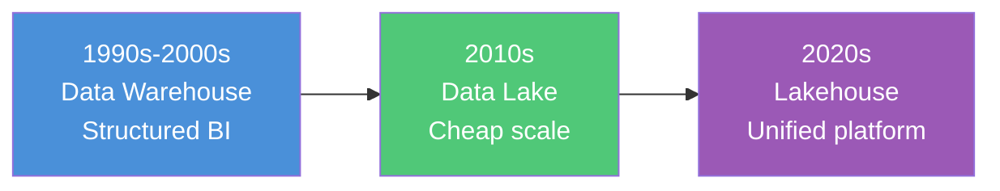
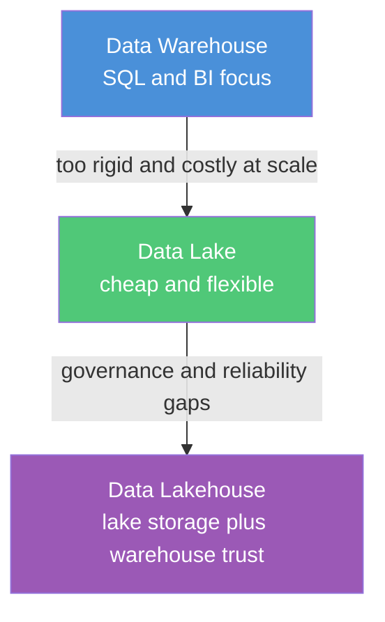

This section explains three core data platform patterns in **separate documents**. Each file owns its own topics — no deep duplication across files.

> **Start here:** [Architecture Map — component diagram & connections](/data-architecture/architecture-map/) shows where every component sits and how they wire together.

| # | Topic | Document | This doc owns… |
|---|-------|----------|----------------|
| 1 | Data Warehouse | [Data Warehouse](/data-architecture/data-warehouse/) | OLTP, OLAP, ETL/ELT, star/snowflake schema, SCD, Kimball, warehouse platforms |
| 2 | Data Lake | [Data Lake](/data-architecture/data-lake/) | Object storage, schema-on-read, ingestion, data swamp, informal medallion |
| 3 | Data Lakehouse | [Data Lakehouse](/data-architecture/data-lakehouse/) | Delta/Iceberg/Hudi, two-tier problem, governed medallion, Unity Catalog |

> **Rule:** Need warehouse depth? Go to `data-warehouse.md`. Need lake depth? Go to `data-lake.md`. This README is only the **index and high-level comparison**.

---

## Why these three exist

Every organization needs to **store**, **process**, and **analyze** data. No single design has solved all three at once. The industry evolved in three waves — each fixing the previous gap and opening a new one.

| Era | Pattern | Problem it solved | Gap it left |
|-----|---------|-------------------|-------------|
| **1990s–2000s** | [Data Warehouse](/data-architecture/data-warehouse/) | Reliable BI and SQL on structured business data | Too expensive and rigid for logs, JSON, IoT, and ML |
| **2010s** | [Data Lake](/data-architecture/data-lake/) | Cheap storage for any data type at massive scale | Weak governance, no ACID — often became a data swamp |
| **2020s** | [Data Lakehouse](/data-architecture/data-lakehouse/) | One platform with lake economics and warehouse trust | Still requires skilled teams to operate well |

**Data Warehouse** — OLTP systems run daily operations, but they cannot power company-wide reporting. The warehouse copied that data into an OLAP-optimized store with fact/dimension models so analysts get one trusted view of revenue, customers, and KPIs.

**Data Lake** — warehouses could not keep up with volume, cost, or new data types (clickstreams, APIs, images). Lakes landed everything cheaply on object storage (S3, ADLS) with schema-on-read — store now, shape later.

**Data Lakehouse** — many companies ran **both**, syncing data between a warehouse for BI and a lake for ML. That meant duplicate copies, duplicate cost, and no single source of truth. The lakehouse added ACID table formats (Delta Lake, Iceberg) and unified governance (Unity Catalog) on lake storage so BI, engineering, and ML share one reliable dataset.

These are **not competitors** — they are stages of the same story. Modern platforms like Databricks target the lakehouse; understanding the warehouse and lake explains why it was built.

---

## Quick comparison

| Dimension | Data Warehouse | Data Lake | Data Lakehouse |
|-----------|----------------|-----------|----------------|
| **Primary goal** | Fast, reliable analytics on structured data | Store any data cheaply at huge scale | One platform for analytics, ML, and engineering |
| **Data types** | Mostly structured (tables) | Structured, semi-structured, unstructured | All types |
| **Storage** | Proprietary DB storage (often expensive) | Cheap object storage (S3, ADLS, GCS) | Cheap object storage |
| **Schema** | Schema-on-write (strict upfront) | Schema-on-read (flexible later) | Schema enforcement when needed |
| **ACID transactions** | Yes (native) | No (by default) | Yes (via Delta Lake, Iceberg, Hudi) |
| **Governance** | Strong (mature) | Weak (often became a "data swamp") | Strong (Unity Catalog, etc.) |
| **Best for** | BI, reporting, SQL dashboards | Raw ingestion, data science, exploration | End-to-end: BI + ML + pipelines on one copy |
| **Typical users** | Analysts, business users | Data engineers, data scientists | Everyone on one governed platform |

---

## How they connect today

The three documents in this folder map to one evolution path:

1. **[Data Warehouse](/data-architecture/data-warehouse/)** — OLTP, OLAP, ETL, star/snowflake schema, fact and dimension tables
2. **[Data Lake](/data-architecture/data-lake/)** — object storage, schema-on-read, ingestion, the data swamp problem
3. **[Data Lakehouse](/data-architecture/data-lakehouse/)** — Delta Lake, medallion layers, Unity Catalog, unified BI + ML

### Document map

---

